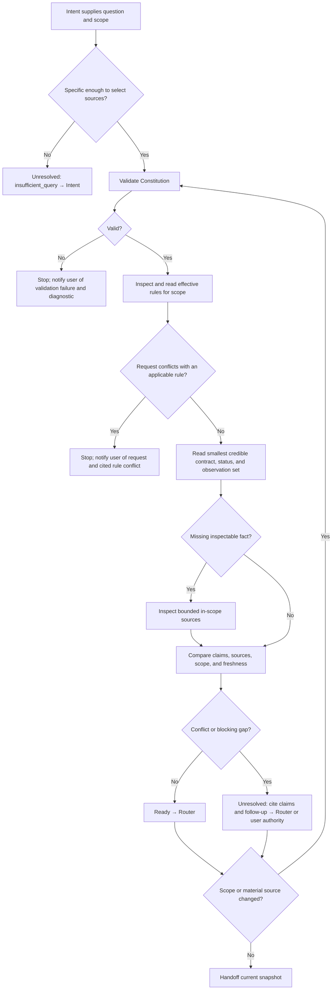

## Rule
Given a concrete information need and target scope from Intent, assemble a
concise, source-backed view of relevant current decisions, work state,
observations, unknowns, and conflicts. Return `ready` or `unresolved` for the
Router. This view is ephemeral and does not revise canonical sources.

## Rationale
The Router needs current evidence without treating observed behavior as an
approved decision or asking the user for facts that bounded inspection can find.

## Application



1. **Select.** A vague question such as “What is happening?” returns
   `insufficient_query` with the target clarification for Intent; do not scan
   broadly or question the user here.
2. **Guard.** Validate the Constitution. On failure, stop and tell the user
   which check failed, citing its diagnostic; do not rely on rule lookup or
   continue the request. On success, inspect all relevant paths and read the
   effective canonical rules. If the request conflicts with an applicable
   rule, stop and tell the user the requested action, the rule path and
   revision, and the specific conflict. Do not perform the conflicting action
   or silently reinterpret the request. Example: a request to activate a
   project rule without user approval conflicts with the governance rule.
3. **Read.** Select only sources needed for the question: contracts or
   decisions for norms; task state, code, tests, Git,
   and command output for observations. Example: to check whether an operation
   is atomic, read its contract and the relevant transaction code and tests.
4. **Reconcile.** Label consequential claims `decision`, `work state`, or
   `observation`; cite each path and section/line or command and observation
   time. Apply precedence only when a cited applicable rule defines it. Keep
   the lower-priority claim visible as an observation. A passing structural
   check does not settle a semantic conflict.
5. **Resolve gaps.** Inspect a missing in-scope fact before returning an
   evidence gap. If a test is unreadable, cite the contract, attempted path,
   and bounded follow-up. If approved sources conflict without precedence,
   preserve both claims and state that a user authority decision is needed.
6. **Handoff.** Return the compact result below. Recheck affected sources if
   scope or material state changes. Preserve existing work; report inaccessible
   sources and unverified claims instead of inventing facts.

Example `ready`: “Is operation X atomic?” → `[decision]` contract requires
atomicity (contract §Persistence); `[observation]` transaction and rollback
test agree (source and test lines, observed now); unknowns: none. If a rule
explicitly ranks disagreeing sources, cite it and keep the lower-ranked claim
as an observation.

```text
Current Truth: <question; scope; observation time if relevant>
Outcome: ready | unresolved
Claims: [decision|work state|observation] <claim> — <source>
Unknowns: <nonblocking unknowns or none>
If unresolved: <insufficient_query|invalid_constitution|rule_conflict|evidence_gap|authority_conflict|other reason>
  <missing question or conflicting sourced claims>; <needed follow-up>
```

`ready` may contain nonblocking unknowns. Send `insufficient_query` to Intent.
For `invalid_constitution` and `rule_conflict`, stop and notify the user with
the cited diagnostic or rule. Do not route or resume the stopped request until
the cause is resolved by its proper authority.
Send inspectable gaps to Router for route selection. Describe authority-bound
conflicts for an explicit user decision; this workflow does not make that
decision. A later handoff mechanism may persist a snapshot, while canonical
contracts and decision records retain their own rationale.
