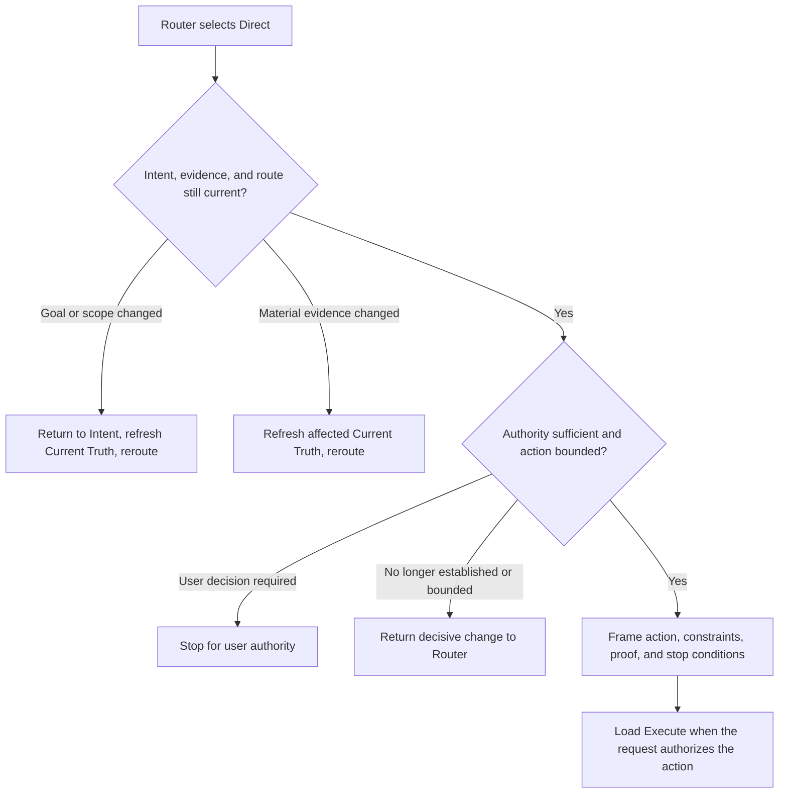

## Rule
After Risk Router selects Direct, recheck its current assumptions and frame the established, bounded action for Execute. Keep the action frame ephemeral and concise. Direct does not select routes, plan, execute work, claim completion, or define Proof of Work.

## Rationale
A short path preserves safety, authority, and proportional verification without adding a second planning ceremony or ordinary approval gate.

## Application



1. **Recheck.** Confirm the routed goal and scope still match confirmed Intent, and that the evidence supporting Direct is current enough. Refresh only affected Current Truth for material changed facts.
2. **Guard.** Return goal or scope drift to Intent. Return a changed implementation assumption, missing fact, expanded boundary, or other failed Direct premise to Router. Stop for an unresolved user-owned decision.
3. **Frame.** State only the bounded outcome, affected repository/module/interface/data/rule boundary, applicable constraints, proportional proof, and conditions that stop execution or require rerouting. Do not create a task breakdown, design comparison, durable action document, or extra gate.
4. **Handoff.** Show the same frame to the user and Execute. When the confirmed request authorizes the framed action, run `inspect-workflow rule-execute` with the same current target paths and read its returned family. Existing destructive-action approvals remain required; Intent confirmation and Direct routing do not grant them.

```text
Direct: <bounded action and affected boundary>.
Proof: <proportional verification>; stop or reroute if <material condition>.
Next: Execute.
```

**Boundary bad:** “This looks easy; change whatever is needed.” **Good:** “Correct the parser branch without changing its interface; reroute if the input contract must change.”

**Framing bad:** list speculative files and subtasks. **Good:** name the bounded change, governing constraint, focused check, and invalidating condition.

**Handoff bad:** “Proceed and verify.” **Good:** “Direct: correct one known formatter branch while preserving public output. Proof: focused regression and required checks; reroute if the shared serializer must change. Next: Execute.”
