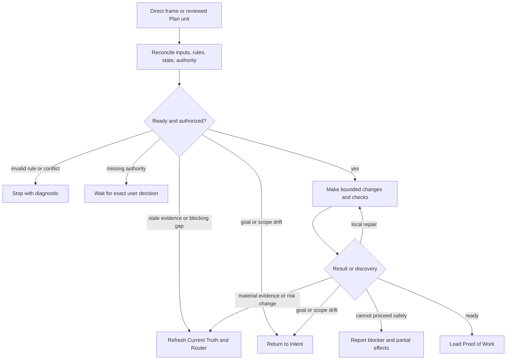

## Rule
After Direct frames an action or Plan reviews an actionable unit, reconcile the current inputs and existing authority, perform only the bounded work, repair local failures, and selectively load Proof of Work when execution is ready for assessment. Execute does not accept final proof or create an approval gate.

## Rationale
Execution needs a clear boundary for useful repairs and honest evidence while leaving product, routing, and proof decisions with their owners.

## Application



1. **Reconcile and bound.** Recheck the Direct frame or reviewed Plan unit, governing contracts, source freshness, dependency or claim state, and existing authorization before mutation. Identify the next concrete change, constraints, applicable checks, and stop conditions. An Epic or planning board alone is not actionable. A deferred question may remain only when it does not affect the next boundary's behavior, safety, authority, or credible verification; state it and return a blocking question to its owner.
2. **Execute and repair.** Make coherent changes inside that boundary. Run useful checks as work proceeds. Repair an implementation or check failure only while the approved outcome, constraints, and approach remain valid; do not repeat an unchanged failure without new evidence or a correction.
3. **Return or stop.** Refresh Current Truth and return to Router when a discovery changes material evidence, risk, or the valid approach. Return a material goal or scope change to Intent. Stop for an action-specific authority decision or when no safe next action exists. Preserve unrelated work and disclose partial effects and unrun checks; do not roll back work without authority.
4. **Handoff.** When bounded execution is ready for assessment, provide the changed unit, checks actually run and their coverage of final artifacts, failures or gaps, and the next assessment. Run `inspect-workflow rule-proof-of-work` with the same current relevant paths, then read its returned family. Proof of Work assesses final outcome; Execute does not claim final completion.

```text
Execute: <unit and changed artifacts>.
Evidence: <checks and observed results>; gaps: <unverified scope or none>.
Next: Proof of Work.
```

**Authority bad:** treat Intent confirmation or a reviewed package as universal permission to mutate. **Good:** use the authority already supplied for the specific unit and stop for a missing action-specific decision.

**Deferred question bad:** silently choose a question that changes the next action's behavior or verification. **Good:** preserve a nonblocking question with its limitation and return a blocking one to its owner.

**Repair bad:** retry an unchanged failing check until it passes. **Good:** fix a local defect with new evidence, then reroute when the failure invalidates the approach or increases material risk.

**Partial effects bad:** report a reroute as if it undid prior edits. **Good:** state changed artifacts, failed or unrun checks, and the exact blocker while preserving unrelated work.

**Handoff bad:** say the work is complete because a check passed. **Good:** load Proof of Work with fresh check evidence and remaining gaps for assessment.
