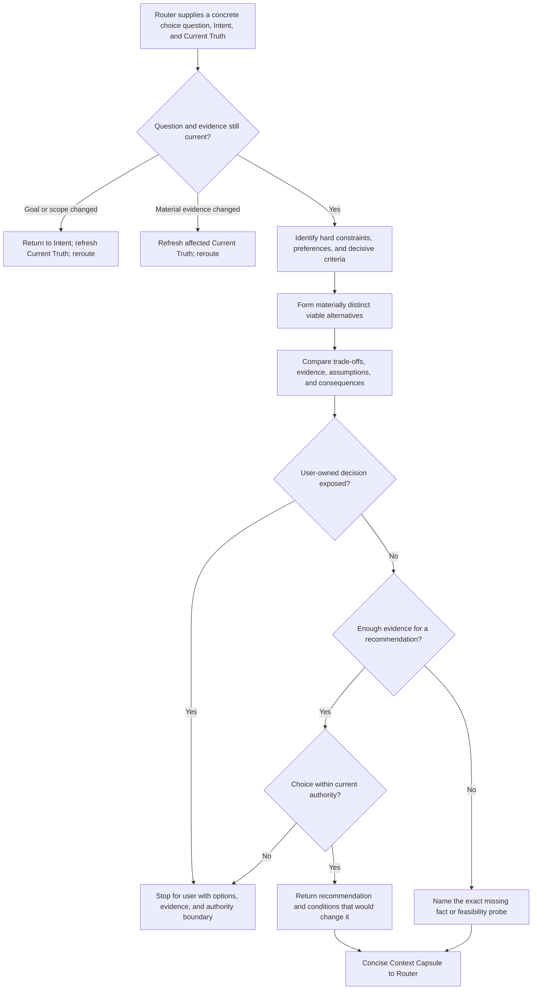

## Rule

After Risk Router selects Explore, compare materially distinct viable approaches
against the confirmed goal, governing constraints, and current evidence. Return
a concise recommendation or exact unresolved discriminator to Router through a
Context Capsule. Do not approve a choice, execute it, plan it, or invoke
Research or Spike directly.

## Rationale

A bounded comparison reduces decision uncertainty without manufacturing a
score, treating a recommendation as authority, or duplicating upstream truth.

## Application



1. **Recheck.** Consume Router's concrete choice question with confirmed Intent
   and relevant Current Truth. Return material goal or scope drift to Intent.
   Refresh affected Current Truth and reroute if evidence or applicable rules
   materially change.
2. **Frame.** Distinguish hard constraints from preferences and name only
   criteria that can change the choice. Do not invent priorities or use
   popularity as evidence of repository fit.
3. **Form alternatives.** Include only materially distinct approaches that can
   satisfy the outcome; include the status quo when credible. Exclude an
   option shown to violate a hard constraint and state the evidence. Do not
   create weak variants to meet an option count.
4. **Evaluate.** Compare decisive benefits, costs, risks, reversibility,
   verification implications, and repository fit. Cite consequential evidence;
   label assumptions and uncertainty. A small table is useful when it clarifies
   exact trade-offs, but do not require numeric weights, totals, rankings, or a
   universal matrix.
5. **Conclude.** Recommend an option only when evidence supports it, state why
   and what would change it. Otherwise name the exact missing fact or bounded
   feasibility probe. Return that need to Router, which selects Research or
   Spike when appropriate. A product, architecture, scope, or governance
   choice outside current authority stops directly for the user's decision;
   never place that authority stop in Router's capsule.
6. **Return.** Show the user and Router the same concise capsule. It is
   ephemeral by default and is routing evidence, not approval, commitment,
   planning, execution, completion proof, or a shared schema. Stop once more
   comparison adds no decision value.

```text
Explore: <concrete choice question>
Options: <materially viable alternatives and decisive trade-offs>
Recommendation: <option and evidence-grounded reason> | unresolved
Evidence: <sources supporting decisive comparison claims>
Assumptions: <material assumptions, or none>
Unknowns: <conditions or missing evidence that could change the conclusion, or none>
Next: Router considers <recommended direction or exact missing fact/probe>
```

Use a compact comparison table in place of `Options` only when it is clearer.
Keep source references attached to consequential claims. Do not merge an
assumption into an evidence claim.

**Alternatives bad:** list several libraries that implement the same approach.
**Good:** compare materially distinct in-process, durable-queue, and credible
status-quo approaches; explicitly exclude one that violates a durability
constraint.

**Evaluation bad:** “A is popular and scores 8/10, so choose A.” **Good:** “A
reuses the established transaction boundary and meets the restart requirement;
B adds an operational service outside the confirmed single-machine scope.”

**Uncertainty bad:** keep gathering generic pros and cons or invoke a sibling
workflow. **Good:** return “whether the provider supports refresh-token
rotation” as the exact discriminator for Router to route.

**Output bad:** present the recommendation as approval or begin changing files.
**Good:** return decisive provenance, assumptions, change conditions, and the
next routing need without acting on the recommendation.
