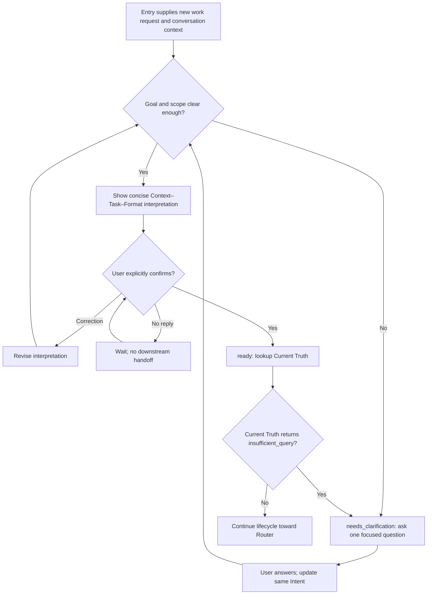

## Rule
For each new work intent, interpret the user's goal and scope from the request
and conversation. Ask about material ambiguity. When interpretable, show a
concise Context–Task–Format interpretation and wait for explicit user
confirmation. Return `ready` only after confirmation; otherwise return
`needs_clarification` when meaning is materially unclear.

## Rationale
A short, visible comprehension check lets the user correct the agent's goal
before Current Truth, routing, or execution. It need not impose later
approval gates on ordinary work.

## Application

1. **Assess.** A request is clear when its desired outcome, scope sufficient
   to select relevant sources, stated constraints, and output preference can
   be expressed without a plausible alternative that materially changes the
   result. Infer routine details; implementation method and repository facts
   belong to later work. Do not silently reinterpret a rule conflict or decide
   a scope expansion for the user.
2. **Clarify.** Return `needs_clarification` with the current interpretation,
   the material ambiguity, and one focused question. Apply the answer to the
   same Intent. Ask again only if a material ambiguity remains.
3. **Confirm.** Before source assembly, routing, or execution, show only
   relevant context, task, and format. If format was not requested, label a
   concise default as proposed. Wait for explicit confirmation; silence,
   elapsed time, a tool result, or agent confidence is not confirmation.
   Corrections update and redisplay the interpretation. Confirmation is about
   comprehension; a later irreversible action may need its own approval.
4. **Handoff.** `ready` carries the confirmed interpretation, a specific
   information need and target scope for Current Truth, stated constraints,
   and any nonblocking assumptions. Invoke `inspect-workflow
   rule-current-truth` with the current relevant paths and read only its
   returned chain before Current Truth. If Current Truth returns
   `insufficient_query`, clarify within this Intent and reconfirm a materially
   revised interpretation. No durable prompt rewrite or shared node schema is
   required. Cancellation or replacement is a conversation control event.

**Clarity bad:** Mark “add a dashboard” ready while a web app and an editor
view are both plausible. **Clarity good:** Ask which surface is intended. For
“shorten the named setup guide,” infer ordinary editing details and present
the interpretation without asking how to edit Markdown.

**`needs_clarification` bad:** “Please provide more details.” **Good:**
“Do you mean a dashboard in the web app or the editor?” The question names
the choice that changes the result.

**Confirmation bad:** “Context: many possible improvements. Task: analyze
everything. Format: comprehensive report.” **Good** for “shorten the setup
guide”: “Context: the setup guide. Task: shorten it while keeping the steps
needed to get started. Format: proposed default—edit the guide and give a
brief summary.” Do not invent a user constraint or claim a proposed format
was requested.

**`ready` bad:** Hand off the unconfirmed interpretation or “research the
repository” without a question or scope. **Good:** After confirmation,
“Task: shorten the setup guide; information need: which setup steps does the
current guide and its approved contract require; scope: the named guide and
directly related setup instructions; constraint: keep those steps.”
---
