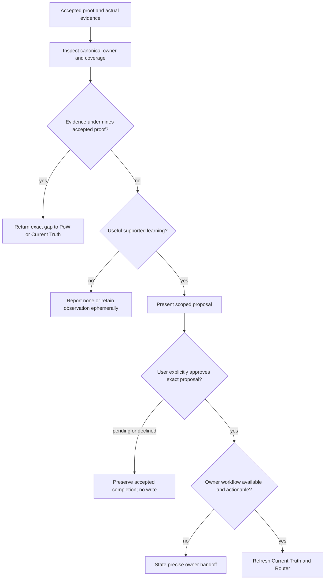

## Rule
Assess actual learning from accepted Proof of Work. Keep unsupported or unnecessary observations ephemeral; otherwise present one concrete, evidence-backed proposal and await explicit user approval before any durable write. An accepted unit remains complete while learning is pending or declined.

## Rationale
Completion evidence can reveal useful guidance without proving that it generalizes. Separating assessment, proposal, approval, and owner handoff preserves reusable learning without inventing policy, duplicate records, or a new completion gate.

## Application



1. **Reconcile.** Confirm that the input is current, accepted proof for this unit. Return unaccepted or stale proof to Proof of Work. New evidence that undermines accepted proof stays visible and returns to PoW, or through Current Truth and Router when it materially changes the work basis. Goal or scope drift returns to Intent; invalid Constitution or a cited rule conflict stops work.
2. **Select.** State the observed lesson, demonstrated scope, limits, future reuse need, and existing coverage. A single strong example may support a narrow correction; recurrence is evidence of reuse, not a quota. Prefer an existing canonical owner. Return `none` when coverage already suffices or the lesson is not useful; do not create a ledger, saved capsule, or other artifact merely to record learning.
3. **Propose.** In conversation, give the exact target and intended change, evidence and semantic basis, benefit, limitations, proportional verification, canonical owner, and revalidation or retirement condition. A test, lint, script, hook, or skill may enforce an existing approved rule but must not invent a product or governance requirement. Saving a proposal is itself a durable write and needs the same approval.
4. **Await authority and hand off.** Explicit user approval must cover the concrete proposal; a material revision needs renewed approval. Pending or rejected learning closes without a durable write and does not reverse accepted completion. Approval authorizes only the stated promotion: refresh Current Truth, let Router select the owning workflow, then use Execute and Proof of Work as applicable. If the owner needs planning or is unavailable, state that exact handoff; Constitution candidates go to H1-T24 without looking up an absent workflow. Do not call a proposal promoted until its owner completes and verifies it.

```text
Learning: <unit> — <none|proposed|awaiting_approval|declined|handed_off>.
Evidence and scope: <sources, demonstrated lesson, and limits; none>.
Proposal: <exact owner, change, basis, benefit, and verification; none>.
Maintenance: <owner and revalidation or retirement condition; if proposing>.
Next: <approval decision or exact owning handoff; accepted unit remains complete>.
```

**Generalization bad:** make a broad policy from one accepted example. **Good:** state the demonstrated boundary and keep uncertain reuse ephemeral.

**Coverage bad:** add a second guide or test before checking existing guidance. **Good:** identify existing coverage and return `none` when it already suffices.

**Persistence bad:** save a draft proposal to request approval. **Good:** present the proposal conversationally and wait before every durable write.

**Authority bad:** treat accepted PoW or a prior generic approval as permission to change a rule or test. **Good:** obtain approval of the exact proposal, then hand it to its canonical owner.

**Completion bad:** hold accepted work open until learning is promoted. **Good:** report pending or declined learning separately while preserving bounded completion.
