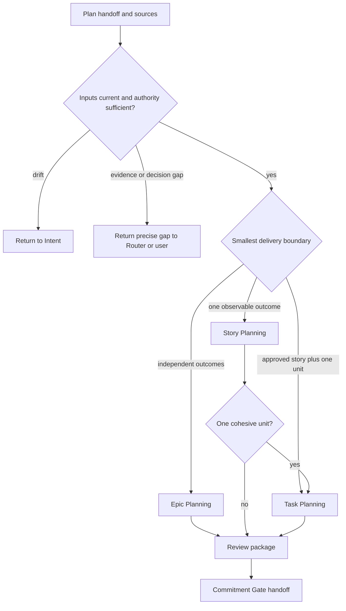

## Rule
After Risk Router selects Plan, reconcile confirmed Intent, Router handoff, Current Truth, the requirement, and applicable Context Capsules. Classify the smallest planning level: Epic for independent outcomes, Story for one observable outcome, or Implementation Task for one technical unit under an approved story. Plan creates a reviewed package and hands it to Commitment Gate; it neither approves execution nor invokes sibling workflows.

## Rationale
Clear but coupled work needs durable, bounded contracts without eagerly loading unrelated planning instructions or treating a recommendation as an approved decision.

## Application

1. Recheck source provenance and keep facts, recommendations, assumptions, and inconclusive results distinct. Return material goal or scope drift to Intent. Return an unproven fact or blocking design choice with the exact need to Router; stop for a user-owned decision.
2. Before any artifact write, present the selected route, exact artifacts, absolute output location, settled decisions, and labelled assumptions or open questions. Wait for explicit confirmation. This authorizes artifact generation only, not execution.
3. Load the selected subprocess only with `inspect-workflow <stable-id>` and current target paths. The coordinator supplies shared context; do not read sibling subprocesses. Compose Story Planning with Task Planning only for a bounded story with one cohesive implementation unit.
4. Review scope, provenance, links, contradictions, observable acceptance and verification, and the selected level's limits. Epic Planning must not pre-plan child stories; Task Planning must not revise story behavior.
5. Report artifacts, review result, blockers, deferred non-blocking questions, and the proposed Commitment Gate package. Only Commitment Gate assesses whether a deferred question permits execution.

**Classification bad:** choose Epic because a task has many files. **Good:** choose Story when those files deliver one observable outcome. **Loading bad:** read all three subprocesses for a Story. **Good:** load Story, then Task only when its single-unit composition applies. **Epic decomposition bad:** write complete child stories while decomposing an Epic. **Good:** create only a future-planning board. **Composition bad:** make a single-unit Story stop without a task specification. **Good:** load Task Planning for its paired specification. **Provenance bad:** record a capsule recommendation as settled. **Good:** cite it as a recommendation until the user or approved contract settles it. **Handoff bad:** say the reviewed plan is approved to execute. **Good:** hand its exact package to Commitment Gate.
