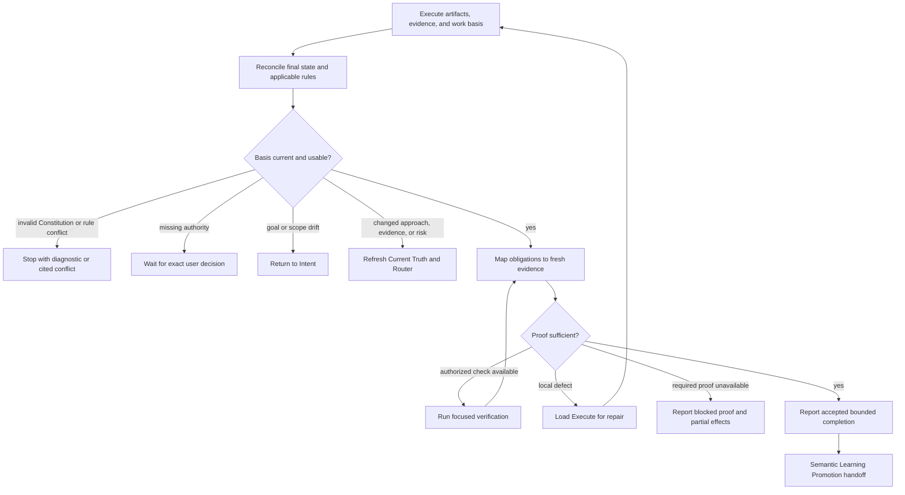

## Rule
Assess Execute's final artifacts and evidence against the existing work basis. Accept a bounded completion only when the requested outcome, mandatory constraints, and required verification have sufficient current proof. This assessment neither grants deployment authority nor completes a parent epic or product-acceptance workflow.

## Rationale
An edit or a passing check can be useful evidence without proving the requested result. A separate assessment preserves that distinction while reusing applicable checks and avoiding a mandatory evidence ledger.

## Application



1. **Reconcile.** Check the current unit, its work basis, final artifacts, applicable rules, and authority. Reuse evidence only when it still covers the final artifacts; a relevant later edit requires the affected check again. Stop on invalid Constitution or an applicable rule conflict. Return material goal or scope drift to Intent, and changed approach, evidence, or risk through Current Truth to Router.
2. **Assess and verify.** Map the requested outcome, mandatory constraints, and required checks to actual evidence and its limits. A passing narrow test is insufficient when it does not cover an observable requirement. Run an authorized, non-mutating focused check when it can close an evidence gap. Required unavailable proof remains unmet; an optional limitation may be disclosed only when it does not defeat the outcome or a governing requirement.
3. **Return precisely.** For a local implementation defect, state the failed obligation, evidence, and required revalidation, then run `inspect-workflow rule-execute` with the current relevant paths if its effective family is not already loaded or the relevant scope or rules changed. Preserve and disclose partial effects. Checks with material writes or external effects need the authority and workflow that govern those effects.
4. **Accept within the boundary.** Report `accepted`, `needs_repair`, `needs_evidence`, or `blocked` with the evidence and limits. Accepted proof supports only the completed unit. Hand off a concise supported learning candidate, or `none`, to Learning Promotion without looking up an absent workflow or creating a durable learning artifact.

```text
Proof of Work: <unit> — <assessment>.
Basis and evidence: <obligations, sources, actual checks, and coverage>.
Gaps or limitations: <exact unmet proof or permissible limitation; none>.
Next: <Execute repair, focused check, owning return, authority, or Learning Promotion>.
```

**Test pass bad:** accept because one narrow test is green. **Good:** link each required outcome and constraint to evidence covering the final artifacts.

**Stale evidence bad:** reuse a check after a relevant edit without reassessment. **Good:** rerun only the check whose coverage the edit affected.

**Unavailable check bad:** call a required external check optional because it cannot run. **Good:** report blocked proof, the exact missing check, and any partial effects.

**Repair bad:** silently change artifacts after an evidence gap. **Good:** return a local defect to Execute, or reroute material approach or risk changes through Current Truth and Router.

**Completion bad:** claim an accepted unit completes the epic or authorizes scenarios. **Good:** state the bounded unit, supported evidence, limits, and semantic Learning Promotion handoff.
