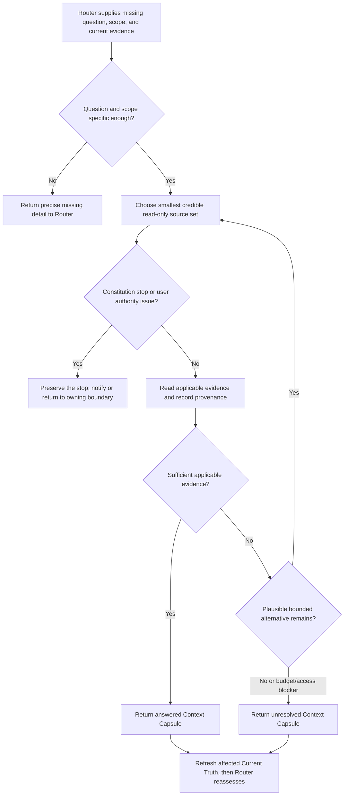

## Rule

After Risk Router selects Research, investigate one concrete missing fact or
source through a bounded, read-only lookup. Return sourced evidence that
answers the question, or an honest unresolved result with the exact remaining
need. Research does not choose a route, approve a decision, run an experiment,
or implement a solution.

## Rationale

Focused evidence gathering reduces uncertainty without duplicating Current
Truth, treating a missing search result as proof, or silently expanding into
design, feasibility, or execution work.

## Application



1. **Bound the question.** Consume confirmed Intent, relevant Current Truth,
   and Router's stated gap. Restate the fact needed and scope. If a material
   goal or scope ambiguity appears, return it to the existing Intent path;
   do not reinterpret the goal.
2. **Select evidence proportionally.** Reuse current relevant evidence, then
   read the smallest credible local or authorized external source set. Do not
   repeat a repository-wide baseline scan. Do not disclose private repository
   material to an external service merely to form a query.
3. **Assess applicability.** Cite consequential claims with a local path and
   section or line, or a direct URL. Record version and observation date when
   relevant. Separate facts, inference, conflict, stale evidence, and access
   limits. Apply precedence only when an applicable rule defines it.
4. **Stop honestly.** Stop when applicable evidence answers the question, an
   agreed budget is reached, credible in-scope sources are exhausted, or a
   concrete access, authority, or conflict blocker remains. Do not retry an
   unchanged failed lookup, infer absence from no result, or broaden without
   limit. Research must not install packages, edit configuration or code, start
   services, or perform a feasibility probe.
5. **Return and reroute.** Refresh affected Current Truth claims, then return
   the result to Router. If alternatives are competing or feasibility requires
   an experiment, state that uncertainty; Router selects Explore or Spike.

Show the user the same concise result given to Router. Headings are optional;
the content is required:

```text
Question: <missing fact and scope>
Result: answered | unresolved
Evidence: <findings, sources, and applicability>
Limits: <inference, conflict, freshness, or access limit; or none>
Remaining need: <specific evidence or authority decision; or none>
```

Keep this Context Capsule conversational by default. Persist one only for a
concrete handoff, resume, repeated-use need, or user request. A saved capsule
is a dated research snapshot, not a contract, Current Truth replacement, or
promotion decision. Write only to an authorized destination; otherwise use a
fresh temporary workspace and report its absolute path. Record question,
scope, source/version references, intended owner or consumer, and conditions
that require revalidation. Refresh affected evidence before reuse when those
conditions change. Follow the owner's retirement policy; do not create a
registry, fixed directory, shared schema, retention system, or automatic
deletion.

**Source bad:** repeat Current Truth's full repository scan, then use current
provider documentation to claim an older pinned version works. **Good:** use
the valid baseline plus one relevant source for Router's question, verify the
applicable version, and qualify what remains unknown.

**Stopping bad:** retry the same inaccessible page or silently run a probe.
**Good:** return partial evidence, the concrete access or feasibility gap, and
the bounded next need for Router to route.

**Capsule bad:** state that research approves a storage choice. **Good:** cite
the capability and limitations, identify the unresolved decision if any, and
leave the next route and approval to their owners.
