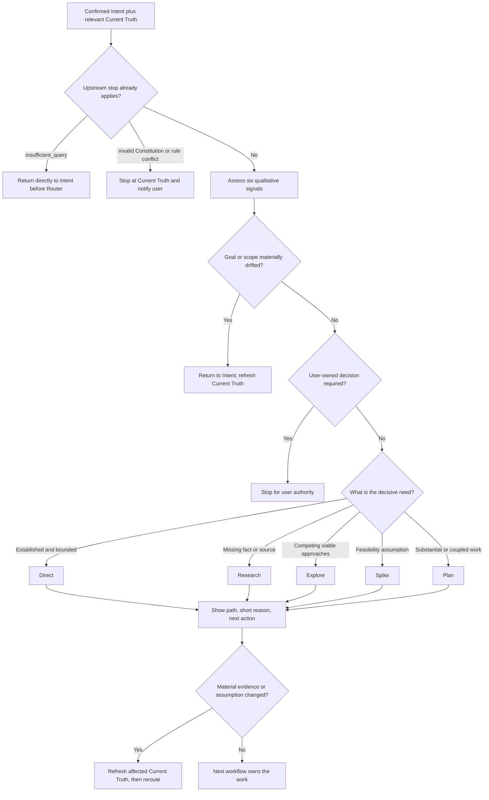

## Rule
Given confirmed Intent and relevant Current Truth, select the smallest credible
next workflow. Explain the decisive reason and next action briefly. Reconsider
the route when material evidence, risk, authority, goal, or scope changes.

## Rationale
A visible, evidence-grounded choice scales ceremony to the work without using
a score to replace judgment or allowing a familiar-looking task to bypass
important uncertainty, authority, or verification boundaries.

## Application



Assess these questions from sourced context. They are reasoning signals, not a
user questionnaire or weighted formula:

1. Is the confirmed goal, scope, and outcome still the work at hand?
2. Is the work within current authority and approved contracts?
3. Is there a demonstrated repository pattern and evidence that it fits?
4. Which module, interface, data, consumer, or rule boundaries will change?
5. What is the main unknown: a missing fact, competing options, or feasibility?
6. How reversible is the work, and how will success or failure be verified?

Use `low`, `medium`, or `high` only when a qualitative level clarifies the
decisive concern. Do not add the levels, apply thresholds, or let several low
concerns cancel one high-consequence signal. A new module does not always
require Plan, and a familiar pattern does not always permit Direct.

Choose one current path:

- **Direct:** established, bounded work with no blocking unknown; hand off to
  the Direct path, then Execute and proportional Proof of Work.
- **Research:** find a missing fact or source; return a sourced Context Capsule
  or unresolved question to Router.
- **Explore:** compare materially viable approaches and trade-offs; return the
  recommendation and evidence through a Context Capsule to Router.
- **Spike:** test one consequential feasibility assumption with a bounded
  probe. A POC may be the probe but is not a separate path or production code
  by default. Return evidence and limitations through a Context Capsule.
- **Plan:** structure clear but substantial or coupled work, then use its
  Commitment Gate before Execute.
- **Return to Intent:** only when the confirmed goal or scope is materially
  wrong, insufficient, or changed. An unknown implementation method belongs
  to Research, Explore, Spike, or Plan instead.
- **Stop for user authority:** state the exact user-owned decision and do no
  downstream work until it is made. This never replaces Current Truth's direct
  Constitution stops.

Research, Explore, and Spike are alternatives for reducing different kinds of
uncertainty, not mandatory prerequisites to Plan. If a route expands the
source set or a material source changes, refresh the affected Current Truth
before rerouting.

Show the user the same ephemeral handoff supplied to the next workflow:

```text
Path: <next path> — <short evidence-grounded reason>.
Next: <specific action, question, probe, or decision>.
```

Do not print the whole matrix or create a per-request routing document.

For an on-demand route, the next action first runs `inspect-workflow` with the
selected stable workflow ID and current target paths, then reads its returned
canonical chain. Router chooses the route; the validator only resolves its
canonical loading chain.

**Intent boundary bad:** return to Intent because the user asked for an auth
API but the authentication mechanism is not chosen. **Good:** keep the
confirmed auth goal and choose Explore, Spike, or Plan for the solution need;
return only if the target system or requested outcome materially changes.

**Route bad:** choose Direct because a similarly named module exists. **Good:**
choose Direct only when sourced evidence shows the pattern fits the affected
boundaries and verification is credible; otherwise name the missing fact,
option, feasibility assumption, or coupling that selects another path.

**Handoff bad:** reproduce every signal and a numeric score. **Good:**
“Path: Spike — token refresh feasibility is unproven against the required
provider. Next: run a bounded compatibility probe and return its evidence.”
