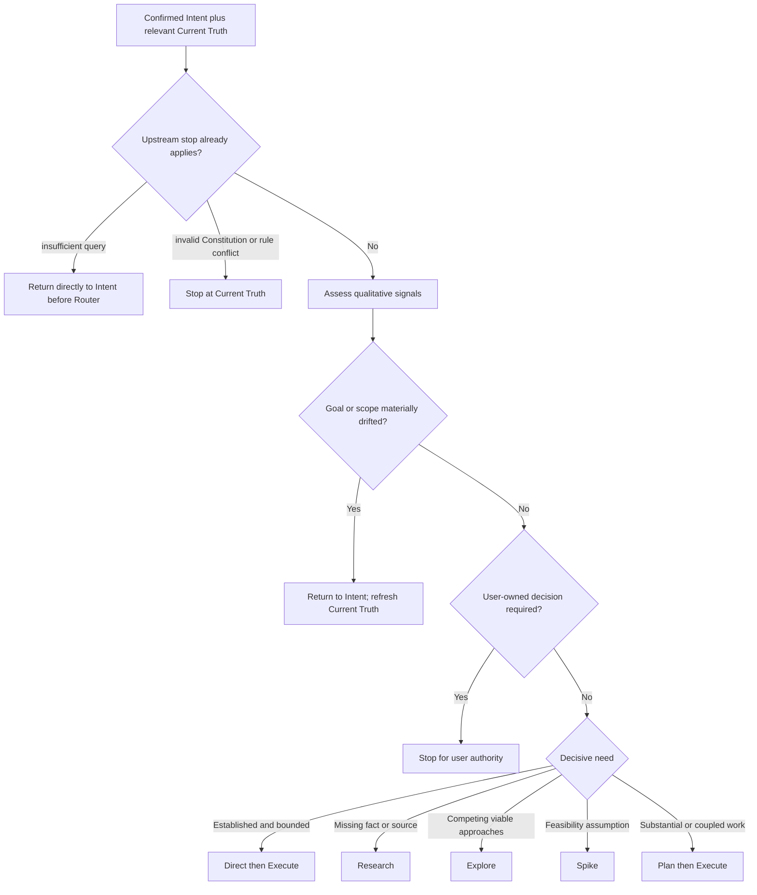

## Rule
Given confirmed Intent and relevant Current Truth, select the smallest credible next workflow. Explain the decisive reason and next action briefly. Reconsider the route when material evidence, risk, authority, goal, or scope changes.

## Rationale
A visible, evidence-grounded choice scales ceremony to the work without using a score to replace judgment or allowing a familiar-looking task to bypass important uncertainty, authority, or verification boundaries.

## Application



Assess whether the goal remains current, authority and contracts cover the work, a demonstrated repository pattern fits, affected boundaries are known, the main unknown, reversibility, and credible verification. These are qualitative signals, not a score or user questionnaire.

Choose Direct for established bounded work; Research for a missing fact; Explore for competing viable approaches; Spike for one consequential feasibility assumption; and Plan for clear but substantial or coupled work. Return a material goal or scope change only to Intent, and a user-owned decision only to authority. Research, Explore, and Spike return their evidence through affected Current Truth before Router chooses again.

For an on-demand route, first run `inspect-workflow` with the selected stable workflow ID and current target paths, then read its returned canonical family. Direct frames an authorized bounded action before Execute. Plan creates a reviewed package; a planning-only request ends there, while a request that authorizes an actionable unit proceeds to Execute. No Commitment Gate is part of the active route.

```text
Path: <next path> — <short evidence-grounded reason>.
Next: <specific action, question, probe, or decision>.
```

**Intent boundary bad:** return to Intent because an implementation method is unknown. **Good:** select Research, Explore, Spike, or Plan unless the requested outcome itself changed.

**Route bad:** choose Direct because a similarly named module exists. **Good:** choose it only when evidence supports the affected boundaries and proof.

**Handoff bad:** send a reviewed Plan package to a universal approval gate. **Good:** retain planning-only packages, or load Execute for an already authorized actionable unit.
