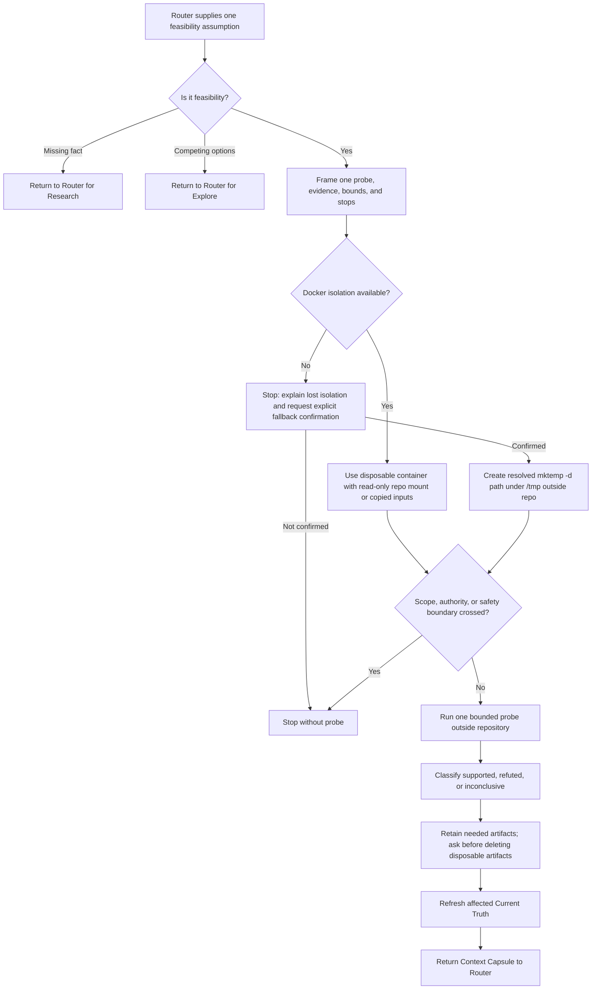

## Rule

After Risk Router selects Spike, test one consequential feasibility assumption
with one bounded, isolated probe. Return sourced evidence, limitations, and a
`supported`, `refuted`, or `inconclusive` conclusion through refreshed Current
Truth to Router. Spike does not compare alternatives, modify production code,
or turn a proof of concept into an implementation.

## Rationale

One isolated probe resolves a feasibility uncertainty while preserving the
working tree, scope, authority boundaries, and the user's control over
artifacts and cleanup.

## Application



1. **Recheck and frame.** Consume Router's named feasibility assumption, one
   probe direction, and confirmed Intent. If the uncertainty is a missing fact,
   return it to Router for Research; if several viable directions require a
   choice, return it for Explore. Before probing, state the evidence that would
   support or refute the assumption, time/resource/scope bounds, and stop
   conditions, including what makes the outcome inconclusive.
2. **Isolate.** Docker is the default and required boundary: use a disposable
   container workspace with a read-only repository mount or only copied probe
   inputs. Keep code, output, caches, and mutations outside the mount; capture
   repository status or diff before and after. If Docker is unavailable or
   insufficient, stop, explain the lost isolation and proposed fallback, and
   wait for explicit confirmation. Only then create a fresh `mktemp -d`
   directory under `/tmp`, resolve it, verify it is outside the repository, and
   keep all probe artifacts there.
3. **Probe and stop.** Run only the declared probe. Stop without execution for
   unconfirmed fallback, scope expansion, unavailable authority, external side
   effect, or another safety boundary. Stop at a declared limit; do not broaden
   the question because related uncertainties appear.
4. **Conclude honestly.** `supported` means observations meet the declared
   supporting threshold; `refuted` means they meet the refuting threshold;
   otherwise report `inconclusive`. A partial observation is not a confident
   result. Preserve commands and provenance sufficient for Router to assess
   the conclusion, and verify the repository remained unchanged.
5. **Retain deliberately.** Retain inconclusive or still-needed POC evidence.
   Disclose every retained container, image, volume, bind mount, temporary
   directory, and generated output by exact path or identifier, contents or
   scope, reason, and state. For a conclusive disposable artifact, ask the user
   before deletion and keep it until explicit authorization. After authorized
   cleanup, report removals and retained related artifacts.
6. **Return.** Refresh affected Current Truth claims, then show Router and the
   user the same conversational capsule. It is routing evidence, not a
   canonical contract, production completion claim, or approval to execute.

```text
Spike: <assumption and one probe>
Bounds: <evidence thresholds, time/resource/scope limits, and stops>
Environment: <actual environment and isolation method>
Integrity: <before/after repository status or diff evidence>
Evidence: <commands or observations with provenance>
Conclusion: supported | refuted | inconclusive — <reasoning>
Limitations: <limits and unknowns, or none>
Artifacts: <each exact path/identifier, contents, retention state, and cleanup status>
Next: refresh Current Truth; Router considers <specific next action or question>
```

**Assumption bad:** probe a library, a service, and a data model at once.
**Good:** test whether one required API operation works under the stated
credential constraint; return multiple viable designs to Explore.

**Bound bad:** keep expanding the POC until it resembles production.
**Good:** stop after the declared operation and time limit, leaving all POC
material outside the repository.

**Conclusion bad:** call one successful partial response supported.
**Good:** report inconclusive when the declared success threshold or relevant
failure observation was not reached.

**Report bad:** say “the spike passed” without environment or artifact detail.
**Good:** identify the Docker image or `/tmp` directory, isolation, commands,
evidence, result, limitation, retention state, and Router's next question.
