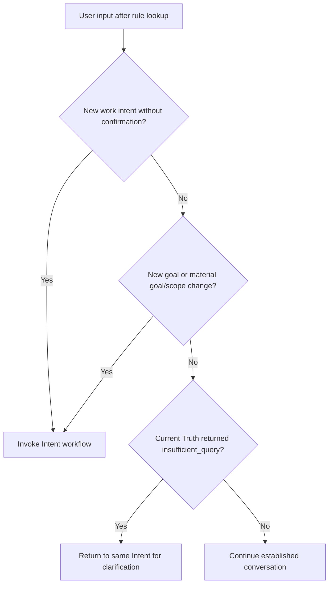

## Rule
After loading effective Constitution rules, invoke the Intent workflow for a
new work intent that has no confirmed interpretation. Continue an established
intent without restarting it. Re-enter Intent for a new goal or material
goal/scope change; return Current Truth `insufficient_query` to the same Intent.

## Rationale
The entry boundary must be discoverable from the Constitution while keeping
the repository entry file short and ordinary conversation free of repeated
startup work.

## Application

Use the request and conversation state to distinguish new work from an answer,
correction, status request, or continuation. A confirmation reply completes the
pending Intent; it is not a new request. Reinspect effective rules when target
paths or material rules change, not on every message.

**Trigger bad:** Treat “yes” in response to Intent's confirmation as a new
intent and ask for another interpretation. **Trigger good:** Confirm the
existing interpretation and let it proceed.

**Handoff bad:** Send a new goal straight to Current Truth using the previous
goal's scope. **Handoff good:** Invoke Intent for the new goal; only its
confirmed `ready` result supplies Current Truth's information need and scope.
---
