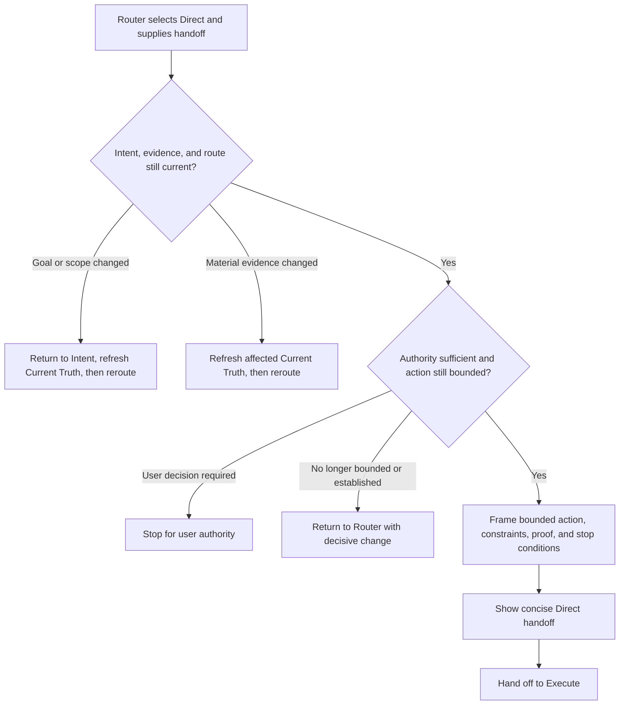

# H1-T14: Establish Direct path workflow

## Parent and outcome

[H1 adaptive repository harness](../epics/H1-build-adaptive-repository-harness.md)
defines a short path for established, bounded work. After H1-T13 Risk Router
selects Direct, this workflow turns the confirmed intent and current evidence
into a small, explicit action boundary and hands it to H1-T20 Execute with
proportional proof expectations. It adds no second planning ceremony or
universal approval gate.

## Inputs and boundaries

- Consume H1-T13's Direct handoff together with the confirmed Intent and the
  relevant Current Truth snapshot. Do not reconstruct those upstream decisions
  from memory or widen the task while framing it.
- Enter only when the approach is established, the affected scope is bounded,
  relevant unknowns are nonblocking, authority is sufficient, and a credible
  verification method is known. The Router owns path selection; Direct checks
  that its entry assumptions still hold but does not maintain a competing
  routing matrix.
- Preserve applicable repository instructions, approved contracts, safety
  limits, and user-owned decisions. Direct is shorter preparation, not weaker
  authority or verification.
- Do not perform implementation, claim that work is complete, approve a
  governance change, or define the internal behavior of the future Execute or
  Proof of Work nodes.

## Workflow



1. **Recheck.** Confirm that the routed goal and scope still match the user's
   confirmed intent and that the evidence supporting Direct is current enough
   for the action. Refresh only affected Current Truth when material facts have
   changed.
2. **Guard.** Stop for an unresolved user-owned decision. Return to Router when
   the action is no longer established or bounded. Return to Intent only for a
   material goal or scope change, not for ordinary implementation detail.
3. **Frame.** State the concrete outcome, affected boundary, governing
   constraints, proportional proof, and conditions that must stop execution.
   Include only details needed to execute safely; do not expand this into a
   task breakdown, design comparison, or durable mini-plan.
4. **Handoff.** Show the user the same concise action frame passed to Execute.
   No additional confirmation is required merely because Direct was selected;
   existing authority and destructive-action approvals still apply. Direct
   ends at this handoff. A downstream node may later return material changed
   evidence for Current Truth and Router without H1-T14 prescribing how that
   node detects, retries, or resolves the change.

## Action frame and output

The action frame is ephemeral by default. It carries these meanings without
requiring a shared schema or a per-request file:

- the bounded outcome and target;
- the repository, module, interface, data, or rule boundary that may change;
- the constraints and authority already in force;
- the provisional proportional check expected to demonstrate success, subject
  to refinement by the future Execute and Proof of Work contracts;
- the facts that would stop execution or require rerouting.

The normal user-visible and downstream handoff is compact:

```text
Direct: <bounded action and affected boundary>.
Proof: <proportional verification>; stop or reroute if <material condition>.
Next: Execute.
```

Omit a field when it adds no information, but never omit a material constraint,
proof expectation, or stop condition. Link to existing canonical sources when
their identity matters; do not copy their full contents into the handoff.

**Boundary bad:** “Direct because this looks easy; change whatever is needed.”
**Good:** “Direct because the existing formatter pattern applies to one known
module; preserve its public output and reroute if the shared serializer must
change.”

**Framing bad:** reproduce a multi-stage implementation plan with speculative
files and subtasks. **Good:** name the bounded change, governing constraint,
focused check, and the condition that would invalidate the short path.

**Handoff bad:** “Proceed and verify.” **Good:** “Direct: correct the existing
parser branch without changing its interface. Proof: focused regression plus
the repository-required checks; reroute if the input contract must change.
Next: Execute.”

## Failure, drift, and authority handling

- A newly missing fact returns through affected Current Truth and Router, which
  may choose Research; competing approaches may lead to Explore; an unproven
  feasibility assumption may lead to Spike; coupled or substantial work may
  lead to Plan. Direct does not choose the replacement path itself.
- A changed target or outcome returns to Intent. A changed implementation
  assumption with the same target normally refreshes Current Truth and returns
  to Router.
- Constitution validation failure or an applicable rule conflict remains a
  Current Truth stop. Direct must not bypass it or reinterpret the request.
- A user-owned decision pauses before execution with the exact decision and
  boundary stated. Direct does not convert an earlier intent confirmation into
  approval for an irreversible or otherwise separately gated action.
- A downstream node may return material changed evidence to Current Truth and
  Router. H1-T14 does not decide retry behavior, completion, or the final Proof
  of Work contract.

## Implementation guidance

Add one concise framework-origin workflow rule under `.harness/workflow/`
using the H1-T1 Constitution format and bounded initial-construction
authorization. Use the flowchart, focused explanation, and paired bad/good
examples above, keeping the rule generic and discoverable through effective
Constitution lookup.

Update the pinned ruleset version, framework-rule provenance, digest, and
derived index consistently, then validate the Constitution. Do not edit the
existing 1.3.0 snapshot under that version, activate project-origin drafts,
create a per-request action document, add a universal workflow schema, or
implement H1-T20 Execute or H1-T21 Proof of Work in this task.

## Verification

- Walk through a familiar one-file correction with a known focused test and
  verify it reaches Execute with a concise action frame and no extra gate.
- Walk through a seemingly small change whose public interface or shared data
  boundary expands; verify Direct returns the changed evidence to Router
  instead of silently widening execution.
- Walk through a missing source, two viable solutions, an unproven dependency,
  and a substantial cross-boundary change; verify each leaves Direct for Router
  without Direct selecting the replacement route.
- Walk through material goal drift versus an implementation-only assumption
  change; verify only goal or scope drift returns to Intent.
- Walk through a user-owned decision and a destructive action requiring a
  separate approval; verify intent confirmation and Direct routing do not
  grant that authority.
- Walk through a downstream reroute request carrying material changed evidence;
  verify Direct's contract permits the upstream return without defining
  Execute's detection or retry semantics.
- Verify the handoff contains the affected boundary, material constraints,
  proportional proof, and meaningful stop conditions without becoming a
  durable mini-plan.
- For documentation-only implementation, check links, examples, Constitution
  validation, and `git diff --check`. Run repository format, lint, and test
  commands if source or tooling changes.

## Definition of done

An agent receiving a Direct route can recheck its assumptions, frame an
established bounded action, preserve authority and safety boundaries, expose
proportional proof and stop conditions, and hand the action to Execute without
adding a planning artifact or approval gate. Material drift returns through
the correct upstream node. The workflow is discoverable through effective
Constitution lookup and passes validation. Record actual acceptance impact at
implementation completion; do not create or execute product acceptance
scenarios here.

## References and planning review

- [H1-T0 validated lifecycle](H1-T0-validate-working-flow.md)
- [H1-T1 Constitution](H1-T1-implement-constitution.md)
- [H1-T11 Current Truth](H1-T11-current-truth.md)
- [H1-T12 Intent](H1-T12-intent.md)
- [H1-T13 Risk Router](H1-T13-risk-router.md)
- [Parent H1 epic](../epics/H1-build-adaptive-repository-harness.md)
- [Constitution lookup](../../.harness/README.md)

Planning decisions: Direct owns bounded action framing after Router, not route
selection or execution. Its action frame is ephemeral, carries outcome,
boundary, constraints, a provisional proof expectation, and stop conditions,
and adds no ordinary confirmation beyond Intent. Existing user-authority and
destructive-action gates remain effective. Independent review first identified
and then verified removal of premature Execute retry/completion and Proof of
Work progression semantics. Final review: READY. H1-T0, H1-T1, H1-T11,
H1-T12, and H1-T13 were re-read after drafting; Direct preserves their
node-first flow, Constitution pinning, Current Truth refresh, Intent boundary,
and Router ownership without creating a durable mini-plan or defining future
nodes. NO CONFLICT. All direct implementation dependencies are `done`, so
H1-T14 implementation is `ready`.

## Implementation result

The [Direct workflow](../../.harness/workflow/rule-direct-r1.md) rechecks the
current Intent, Current Truth, and Router assumptions before framing an
ephemeral bounded action for Execute. It preserves existing authority and
destructive-action gates, requires proportional proof and meaningful stop
conditions, and returns material drift to the owning upstream node without
defining Execute or Proof of Work behavior.

Manual workflow walkthrough on 2026-09-27:

- A known one-file parser correction with a focused regression reaches Execute
  with no additional approval gate.
- A shared serializer or public input-contract expansion returns the changed
  evidence to Router rather than widening Direct execution.
- Missing evidence, viable alternatives, unproven feasibility, and substantial
  cross-boundary work return to Router without Direct selecting the replacement
  route.
- Goal or scope drift returns to Intent; an implementation-only assumption
  change refreshes Current Truth and reroutes. User-owned and destructive
  decisions remain stopped for their separate authority.

The Constitution moved to pinned ruleset 1.4.0 with matching framework-rule
provenance, recomputed digest, and rebuilt index. `validate` and
`inspect-effective` passed and expose the new rule. The isolated Constitution
suite passed with 11 tests and 51 assertions; repository format, lint, and
full tests passed. Acceptance impact: `none`, because this repository-agent
workflow changes no `tbtm` product behavior or product acceptance scenario.
