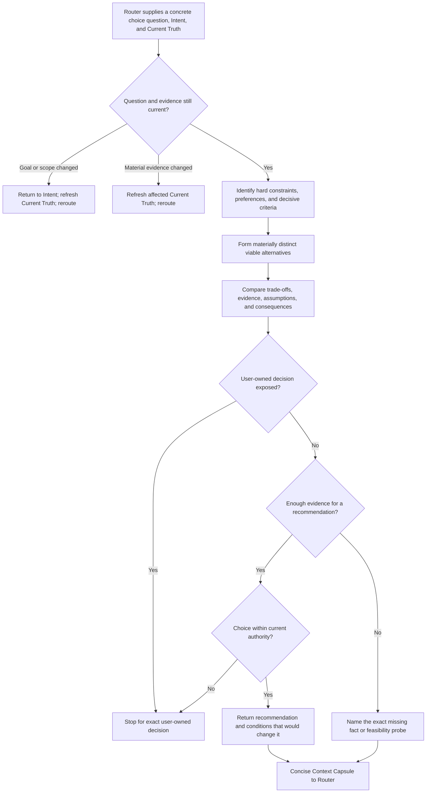

# H1-T16: Establish Explore workflow

## Parent and outcome

[H1 adaptive repository harness](../epics/H1-build-adaptive-repository-harness.md)
defines Explore as the uncertainty-reduction path for materially viable
alternatives. After H1-T13 Risk Router selects Explore, this workflow compares
the alternatives against the confirmed goal, governing constraints, and
current evidence, then returns a concise recommendation or a precise unresolved
discriminator to Router through a Context Capsule.

Explore does not approve a choice, execute it, create a plan, or replace a
missing-fact Research workflow or feasibility Spike.

## Inputs and boundaries

- Consume Router's concrete choice question together with the confirmed Intent
  and relevant Current Truth. Reuse their scope, constraints, sources, known
  unknowns, and authority boundaries instead of reconstructing them from
  memory.
- Enter when two or more approaches are materially viable or when the current
  evidence does not yet justify choosing among them. A superficial list of
  variants is not an Explore problem. There is no required option count; the
  status quo is an option when it can credibly meet the confirmed outcome.
- Derive evaluation criteria from confirmed Intent, applicable Constitution
  rules, approved contracts, and relevant Current Truth. Distinguish hard
  constraints from preferences. Do not invent priorities or treat popularity
  as evidence of repository fit.
- Preserve user authority. A recommendation within approved scope may return
  to Router; a choice that changes an approved product, architecture, or
  governance contract stops with the exact user-owned decision stated.
- Explore may identify that a missing fact or bounded feasibility probe is the
  decisive next need. It returns that need to Router, which owns rerouting to
  Research or Spike. Explore does not invoke sibling workflows directly.

## Workflow



1. **Recheck.** Confirm that the question, goal, scope, evidence, and applicable
   rules remain current. Return material goal or scope drift to Intent. Refresh
   affected Current Truth and reroute when material evidence changes.
2. **Frame the comparison.** State one concrete choice question. Extract hard
   constraints and preferences, then name only criteria that can change the
   choice. Do not turn every desirable property into a checklist item.
3. **Form viable alternatives.** Include materially distinct approaches that
   could satisfy the outcome. Exclude an option when evidence shows it violates
   a hard constraint, and state that reason. Do not invent weak alternatives to
   reach a quota. Include the current approach when retaining it is credible.
4. **Evaluate.** Compare decisive benefits, costs, risks, reversibility,
   verification implications, and repository fit using available evidence.
   Cite consequential evidence and label assumptions or uncertainty. Use a
   small table when it improves clarity, but do not require numeric weights,
   totals, rankings, or a universal matrix.
5. **Conclude.** Recommend one option when the evidence supports it and state
   why plus the conditions that would change the recommendation. When it does
   not, name the exact missing fact or feasibility probe. If the comparison
   exposes a user-owned choice, stop directly with the options, evidence, and
   authority boundary; do not pass that decision through Router. Stop once
   further comparison would add no decision value.
6. **Return.** Give Router the same concise Context Capsule shown to the user.
   Router decides the next path for a recommendation, missing fact, or probe.
   A recommendation is evidence for routing, not approval, commitment,
   planning, execution, or completion proof. An authority stop resumes routing
   only after the user decides and affected upstream context is refreshed.

## Context Capsule and outcomes

The capsule is ephemeral by default and has no mandatory shared schema or
per-request file. It conveys only what Router needs:

```text
Explore: <concrete choice question>
Options: <materially viable alternatives and decisive trade-offs>
Recommendation: <option and evidence-grounded reason> | unresolved
Evidence: <sources supporting the decisive comparison claims>
Assumptions: <material assumptions, or none>
Unknowns: <conditions or missing evidence that could change the conclusion, or none>
Next: Router considers <recommended direction or exact missing fact/probe>
```

A compact comparison table may replace the `Options` line when several exact
trade-offs are easier to inspect that way. Source references remain attached
to consequential claims; the capsule summarizes rather than duplicating
canonical contracts or Current Truth. Evidence may cite the relevant Current
Truth claims instead of restating their source contents. Do not merge an
assumption into an evidence claim; Router must be able to see what remains
unverified and which source or assumption would invalidate the recommendation.

**Question bad:** “Explore the architecture and find the best design.”
**Good:** “Choose whether repository event delivery should use the established
in-process dispatcher or a durable queue while preserving the confirmed
single-machine scope and restart requirements.”

**Options bad:** list three libraries that implement the same approach merely
to appear comprehensive. **Good:** compare the materially distinct in-process,
durable-queue, and credible status-quo approaches; exclude one explicitly when
it violates a hard durability constraint.

**Evaluation bad:** “A is popular and gets 8/10, so choose A.” **Good:** “A
reuses the repository's established transaction boundary and passes the
restart requirement; B adds cross-process durability but also an operational
service outside the confirmed scope. Recommend A while the scope remains
single-machine.”

**Unresolved bad:** continue collecting generic pros and cons. **Good:** “The
choice turns on whether the required provider supports refresh-token rotation;
return that bounded compatibility probe to Router for Spike.”

**Output bad:** present the recommendation as user approval or begin changing
files, or omit the source and assumption behind the decisive trade-off.
**Good:** return the recommendation, decisive evidence with provenance,
material assumptions, and change conditions to Router for the next route
decision.

## Drift, evidence, and authority handling

- A material change to the target or outcome returns to Intent. Changed facts
  or an expanded source set refresh affected Current Truth before comparison
  continues or Router chooses another path.
- Constitution validation failure and applicable rule conflict remain Current
  Truth stops. Explore cannot compare ways to bypass a governing rule.
- A missing inspectable fact is described for Router to route to Research. An
  uncertain consequential feasibility assumption is described as a bounded
  probe for Router to route to Spike. Substantial clear work may next route to
  Plan. Explore names the need but does not choose the replacement route.
- A user-owned product, architecture, scope, or governance decision pauses the
  workflow with the exact options, evidence, and authority boundary visible.
  It does not enter the Router capsule; after the user decides, refresh the
  affected upstream context and resume routing.
- New evidence may change or remove the recommendation. Explore states the
  conditions that would do so rather than defending an earlier conclusion.

## Implementation guidance

Add one concise framework-origin Constitution workflow rule under
`.harness/workflow/` using the H1-T1 rule contract and initial-construction
authorization. Use the flowchart, focused instructions, and paired bad/good
examples above. Keep the rule generic and discoverable through effective
Constitution lookup.

Update the pinned ruleset version, framework-rule installation provenance,
framework digest, and derived index consistently, then validate the
Constitution. Do not edit the existing pinned snapshot under its old version,
activate project-origin drafts, create a per-request comparison document,
define a universal Context Capsule schema, add a scoring engine, or implement
Research, Spike, Plan, Commitment Gate, or Execute within this task.

## Verification

- Walk through a choice with two materially viable approaches and verify the
  recommendation cites decisive repository evidence, hard constraints, and
  change conditions without numeric scoring.
- Walk through a credible status quo and an option set containing superficial
  variants; verify the status quo is considered and variants are consolidated
  without enforcing a count.
- Walk through an option that violates a hard constraint; verify it is excluded
  with evidence instead of remaining in a weighted comparison.
- Walk through a missing authoritative fact and an unproven feasibility
  assumption; verify Explore returns the exact discriminator to Router for
  possible Research or Spike without invoking either workflow.
- Walk through insufficient evidence after bounded comparison; verify the
  capsule returns `unresolved` with the smallest useful follow-up rather than
  a fabricated recommendation or endless analysis.
- Walk through a recommendation that stays within authority and a choice that
  changes an approved contract; verify only the latter stops directly for the
  user's decision without entering Router, and neither starts execution.
- Change the goal, scope, material source, or applicable rule during the
  comparison; verify the correct Intent or Current Truth refresh and reroute
  path is used.
- Verify the user-visible capsule is concise, source-backed, ephemeral, and
  sufficient for Router without becoming approval, a plan, or a common schema.
- For documentation-only implementation, check links, examples, Constitution
  validation, and `git diff --check`. Run repository format, lint, and test
  commands if source or tooling changes.

## Definition of done

An agent receiving an Explore route can frame one concrete choice, compare
materially viable alternatives against sourced constraints and decisive
criteria, expose assumptions, and return either a defensible recommendation or
the exact unresolved discriminator to Router. It preserves upstream truth and
authority, does not invoke sibling workflows or act on the recommendation,
and adds no durable comparison artifact, universal capsule schema, or scoring
system. The workflow is discoverable through effective Constitution lookup
and passes validation. Record actual acceptance impact at implementation
completion; do not create or execute product acceptance scenarios here.

## References and planning review

- [H1-T0 validated lifecycle](H1-T0-validate-working-flow.md)
- [H1-T1 Constitution](H1-T1-implement-constitution.md)
- [H1-T11 Current Truth](H1-T11-current-truth.md)
- [H1-T12 Intent](H1-T12-intent.md)
- [H1-T13 Risk Router](H1-T13-risk-router.md)
- [Parent H1 epic](../epics/H1-build-adaptive-repository-harness.md)
- [Constitution lookup](../../.harness/README.md)

Planning decisions: Explore owns one concrete comparison after Router, uses
sourced qualitative criteria without a fixed option count or mandatory score,
and returns an ephemeral recommendation or exact unresolved discriminator.
Status quo is included when viable; hard constraints and preferences remain
distinct; user-owned decisions stop explicitly. The user approved these
decisions. Independent decision review initially found that the capsule
template did not expose evidence provenance and assumptions; the template now
carries both explicitly, and re-review concluded `READY`. After drafting,
H1-T0, H1-T1, H1-T11, H1-T12, and H1-T13 were re-read. Explore preserves the
node-first flow, pinned Constitution boundary, sourced Current Truth,
confirmed Intent, and Router ownership; it adds no competing source of truth,
universal capsule schema, route selector, or approval. Dependency cross-check:
`NO CONFLICT`. All direct implementation dependencies are `done`, so H1-T16
implementation is `ready`. Final direct-document review found and then verified
the correction of one authority boundary: user-owned decisions now stop
directly, while only recommendations and missing fact/probe outcomes return to
Router. Final review: `READY`.
