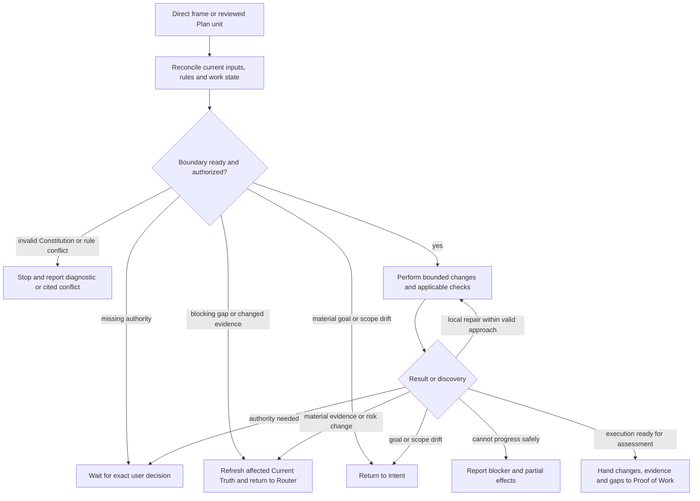

# H1-T20: Establish Execute workflow

## Parent and outcome

[H1 adaptive repository harness](../epics/H1-build-adaptive-repository-harness.md)
defines Direct → Execute and Plan → Execute. After receiving a bounded Direct
action frame or a reviewed Plan package, Execute performs authorized work,
checks and repairs it within the approved boundary, and hands the resulting
changes and evidence to Proof of Work. Execute does not itself accept final
proof or equate a finished edit with completion of the requested outcome.

[TD-0008](../decisions/TD-0008-defer-h1-commitment-gate.md) removed Commitment
Gate from the target flow. This task also aligns the installed Router and Plan
rules with that decision through a new pinned Constitution snapshot. Prior
task contracts remain historical records of their original gate decisions.

## Inputs and authority

- Consume confirmed Intent, relevant Current Truth and applicable rules,
  together with either Direct's action frame or the exact reviewed Plan
  package and its governing parent contracts.
- Direct supplies the outcome, affected boundary, constraints, provisional
  proof and stop conditions. Plan supplies the actionable implementation unit,
  acceptance criteria, verification and any explicitly deferred questions.
  An Epic or planning board alone is not an actionable implementation unit.
- Recheck source freshness, dependency readiness, target work state and
  existing authorization before mutation. Apply repository-specific task
  claims when required; do not invent a generic claim system. Preserve other
  sessions' work and do not overwrite an existing claim.
- Intent confirmation, route selection and package review do not grant
  execution authority. Use authorization already supplied by the request or
  conversation; ask only for a missing user-owned decision or an applicable
  action-specific approval. No new universal execution approval is introduced.
- Assess a deferred question against the next execution boundary. Continue
  only when it does not affect that boundary's behavior, safety, authority or
  credible verification. State the limitation and preserve the open question.
  A blocking question returns to its owner; Execute does not silently settle
  product or architecture decisions or recreate Commitment Gate.

## Workflow



1. **Reconcile.** Read only the sources needed for the selected unit. Reinspect
   applicable rules when relevant paths or rules change; refresh affected
   Current Truth when material evidence changes. Invalid Constitution or an
   applicable rule conflict stops directly with the diagnostic or cited rule.
2. **Bound.** Identify the next concrete change, constraints, relevant checks
   and stop conditions from the existing inputs. Resolve inspectable facts by
   bounded reading. Return a blocking solution or feasibility gap to Router,
   and a user-owned decision to authority. Do not expand a Direct action into
   an unapproved design or rewrite Plan acceptance criteria.
3. **Execute.** Make coherent changes within the authorized boundary. Keep
   local claim/status conventions and core/consumer boundaries. Run applicable
   checks during work when they inform the next action; their scope follows
   the contract and governing verification rules.
4. **Repair or return.** Fix local implementation or check failures while the
   same approved outcome, constraints and approach remain valid. Do not retry
   unchanged failing actions without new evidence or a concrete correction.
   If a discovery invalidates the approach or materially changes risk, refresh
   the affected Current Truth and return to Router with the decisive evidence;
   Router chooses the replacement route. Only a material goal or scope change
   returns to Intent. Stop when a safe next action cannot be established.
5. **Preserve and hand off.** On a stop or return, disclose completed changes,
   partial effects, failed or unrun checks and the exact blocker. Do not discard
   unrelated work or perform destructive rollback without the required
   authority. On normal exit, hand the resulting artifacts, evidence and gaps
   to Proof of Work for assessment without claiming final completion.

## Evidence and output boundary

The handoff is conversational by default, linked to existing artifacts and
command results. No mandatory execution ledger, shared node schema, persistent
session state or independent reviewer is introduced.

Carry the meanings below, scaled to the work:

- the executed unit and its governing contract or Direct frame;
- changes and any material partial effects;
- checks actually run, their outcomes, what changed since each check, and any
  reason an earlier result no longer applies to the final artifacts;
- failed, skipped or unavailable verification and remaining uncertainty;
- the next assessment or exact return/authority need.

```text
Execute: <unit and changed artifacts>.
Evidence: <checks and observed results>; gaps: <unverified scope or none>.
Next: Proof of Work.
```

For an interrupted execution, replace the normal next step with the exact
blocker and owning boundary, including partial effects. Do not call failed
checks passing, treat unavailable checks as proof, or imply that routing back
undoes committed effects.

Proof of Work remains a separate node. Its assessment basis is the work
contract (Plan criteria and verification, or confirmed Intent, existing
contracts and Direct proof expectations) plus applicable Constitution and
repository verification rules. Execute supplies evidence that PoW may reuse
when it still covers the final artifacts; PoW does not receive a competing set
of acceptance criteria invented by Execute. H1-T21 will define sufficiency,
assessment outcomes and subsequent progression. This task does not implement
those mechanisms or require all checks to be repeated there.

## Implementation guidance and deliverables

1. Add one generic framework-origin `rule-execute-r1.md` under
   `.harness/workflow/` with `contextLoading: on_demand`. Use the flowchart,
   short instructions and paired bad/good examples for authority, deferred
   questions, local repair versus material drift, partial effects and evidence
   handoff. Keep repository-specific paths and status policy out of the generic
   rule; consume them through applicable instructions.
2. Align the effective Router and Plan coordinator with Plan → Execute under
   TD-0008. Remove runtime reliance on Commitment Gate, including Plan's
   assignment of deferred-question readiness exclusively to that gate. Review
   Plan subprocess text for stale gate assumptions and revise only where
   required for this handoff. Preserve planning confirmation and package
   review boundaries.
3. When the confirmed request authorizes proceeding with an actionable unit,
   Direct and Plan handoffs load `rule-execute` by stable ID through
   `inspect-workflow` with the same current relevant paths, then read only its
   returned family. A planning-only request ends with the reviewed package and
   proposed successor; it does not load Execute, claim implementation or ask
   for execution permission merely to advance the lifecycle. Missing
   action-specific authority during authorized execution still stops at
   Execute. Execute remains absent from bootstrap and unrelated route
   lookup. Do not connect it through `extends` merely to force eager loading.
4. Install these semantic changes as new rule revisions where required by
   H1-T1, with explicit supersession and retained published history. Update the
   pinned framework/ruleset version, framework provenance, digest and derived
   index consistently under the initial H1 construction authorization; validate
   the resulting Constitution.
5. Until H1-T21 is installed, end at the semantic PoW handoff. Do not invoke
   lookup for an absent PoW rule, add a placeholder active rule, claim that the
   full downstream lifecycle is implemented, or make H1-T21 a prerequisite
   merely to document this output boundary.

No product source, CLI behavior, migrations, general upgrade workflow,
project-rule activation, Commitment Gate, PoW implementation, Learning
Promotion or product acceptance scenarios belong to this task.

## Functional and non-functional acceptance criteria

- Both Direct and an actionable reviewed Plan unit reach the same Execute
  workflow through selective lookup, retaining their distinct preparation.
- Execution starts only with current actionable inputs, satisfied applicable
  dependency/claim rules and sufficient existing authority.
- Nonblocking deferred questions remain explicit; blocking questions leave
  execution before the affected action.
- Local repair proceeds without unnecessary approval when the boundary is
  valid. Material drift reaches its owning upstream node without silent scope
  expansion or a competing route decision.
- Stops and returns preserve unrelated work and report actual partial effects.
- Normal output supplies traceable check results and verification gaps to PoW,
  without final completion claims or stale proof presented as current.
- The workflow is concise, generic and usable in a dirty shared worktree.
  It adds no mandatory per-request file, fixed retry quota or universal gate.
- All canonical rules remain versioned, pinned, validated and independently
  loadable; prior published revisions remain auditable.

## Test and verification plan

- Walk through a familiar Direct correction and a planned implementation unit;
  verify entry, constraints, applicable claims and semantic PoW handoff.
- Supply a reviewed Epic without an actionable unit, stale dependency state,
  an existing session claim and missing execution authority; verify mutation
  does not start and the exact gap is reported to its owner.
- Exercise a nonblocking deferred question and one that affects the next
  action's behavior, safety or verification; verify only the former permits
  that bounded action and neither question is silently settled.
- Exercise a focused check failure fixed locally, an unchanged recurring
  failure, a newly invalid approach, materially increased risk and changed
  user scope; verify repair, safe stop and return ownership match the workflow.
- Exercise invalid Constitution, a rule conflict and an action-specific
  approval boundary; verify no universal gate or authority bypass appears.
- Stop after partial changes in a dirty worktree; verify effects and remaining
  checks are disclosed and unrelated changes are preserved.
- Supply evidence from before a later edit, fresh evidence for unchanged
  artifacts and an unavailable check; verify freshness/coverage and gaps are
  conveyed without inventing a final PoW verdict or requiring repeat checks.
- Verify effective Router/Plan text has no operational Commitment Gate
  dependency, while retained historical revisions remain readable.
- Verify bootstrap excludes Execute, Direct/Plan lookup does not eagerly load
  it, and explicit successor lookup selects only Execute's effective family.
  Verify a planning-only request ends at package delivery without Execute
  loading, implementation claims or an unsolicited execution approval request.
  Verify no lookup for an absent PoW workflow is emitted.
- Run Constitution validation, isolated Constitution tests and the repository
  checks required at implementation handoff:

```bash
rtk proxy .harness/scripts/validate-constitution validate
rtk mise run format
rtk mise run lint
rtk mise run test
rtk git diff --check
```

## Definition of done

An agent can enter Execute from Direct or Plan, perform authorized bounded
work, repair local failures, preserve and report partial effects, return
material discoveries correctly, and hand evidence to PoW without declaring
final proof acceptance. The installed Router/Plan flow reflects TD-0008 and
the new Execute workflow loads only when selected. Constitution integrity and
required implementation checks pass. At implementation completion, record
actual acceptance impact and update task/epic/dashboard status; do not create,
edit, review or execute files under `docs/testing/` here.

## References and planning review

- [Parent H1](../epics/H1-build-adaptive-repository-harness.md)
- [H1-T1 Constitution](H1-T1-implement-constitution.md)
- [H1-T11 Current Truth](H1-T11-current-truth.md)
- [H1-T12 Intent](H1-T12-intent.md)
- [H1-T13 Risk Router](H1-T13-risk-router.md)
- [H1-T14 Direct](H1-T14-direct-path.md)
- [H1-T18 Plan](H1-T18-plan.md)
- [H1-T18A lazy loading](H1-T18A-lazy-workflow-loading.md)
- [H1-T18B staged loading](H1-T18B-staged-core-workflow-loading.md)
- [TD-0008 defer Commitment Gate](../decisions/TD-0008-defer-h1-commitment-gate.md)
- [Constitution lookup](../../.harness/README.md)

User-confirmed decisions: Execute runs applicable checks and local repairs;
PoW remains a separate assessment node using the work contract and governing
verification rules, with detailed PoW mechanics deferred to H1-T21. Existing
authority remains effective without a universal execution gate. Independent
decision review: `READY`. Final direct-document review: `READY`, with its
planning-only successor-loading clarification incorporated.

After drafting, H1-T1, H1-T11, H1-T12, H1-T13, H1-T14, H1-T18A,
H1-T18B, H1-T18, parent H1 and TD-0008 were re-read. Execute preserves
Constitution versioning and history, Current Truth provenance and stops,
confirmed Intent, Router ownership, Direct's bounded frame, Plan package
boundaries and selective successor loading. Historical Commitment Gate
references are reconciled by TD-0008; their runtime alignment is an explicit
H1-T20 implementation deliverable, not a claim about the installed snapshot.
Dependency cross-check: `NO CONFLICT`. All direct implementation dependencies
are `done`, so implementation is `ready`.
