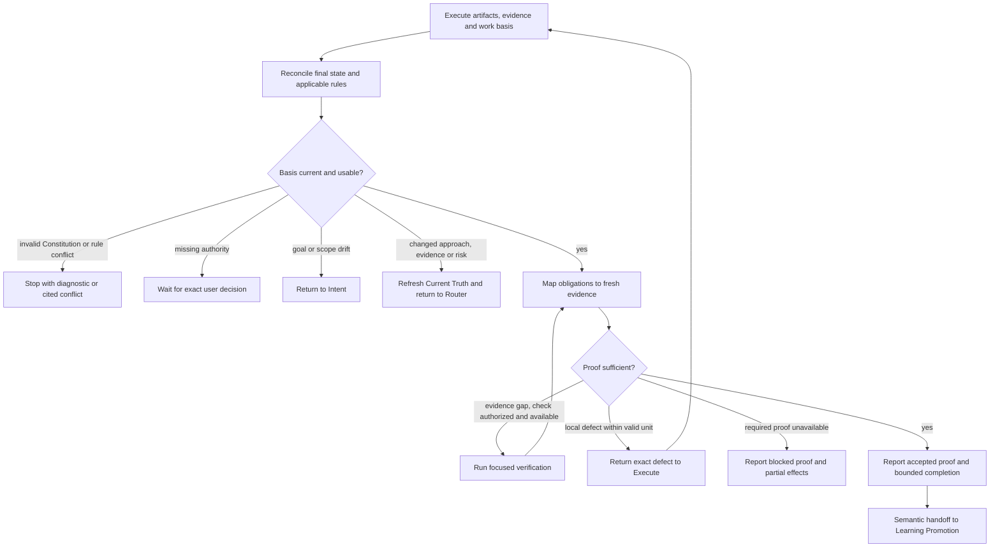

# H1-T21: Establish Proof of Work

## Parent and outcome

[H1](../epics/H1-build-adaptive-repository-harness.md) requires completion
claims backed by the work contract and recorded evidence. Proof of Work
assesses Execute's final artifacts and evidence against that existing basis,
identifies the exact unmet obligation, and permits a completion claim only
when the requested bounded outcome has sufficient proof.

This is one technical unit under approved H1, not a new product story. The
product PRD supplies no H1 behavior; no product contract changes are required.

## Inputs and assessment basis

- Consume Execute's unit, governing Direct frame or reviewed actionable Plan,
  changed artifacts, partial effects, checks and gaps. Read the confirmed
  Intent and governing contracts plus applicable verification rules as needed.
- Assess observable outcome, constraints and required verification together.
  Plan criteria or the Direct frame express the work basis; Execute evidence
  does not redefine it. A passing test or structural validator alone cannot
  prove a semantic requirement it does not cover.
- Reconcile final artifact state with each check's actual coverage and
  freshness. Reuse results that still apply. A later change invalidates only
  affected evidence; require the relevant check again, not every check by
  default. A claimed pass without traceable evidence is an evidence gap.
- Follow existing authority, task claims and acceptance ownership. PoW may
  run authorized, non-mutating verification within the selected unit. Checks
  with material writes or external effects require the authority and workflow
  applicable to those effects. Product acceptance execution remains a separate
  workflow; PoW cannot create, approve or run scenarios during implementation.
- Resolve inspectable facts through bounded reading. Required but unavailable
  checks remain unmet. Optional unverified scope may be disclosed only when it
  does not defeat the requested outcome or a governing requirement.

## Workflow and outcomes



1. **Reconcile.** Check that the handoff concerns the current unit and final
   artifacts. Reinspect relevant rules when paths or rules change; refresh
   Current Truth for material new evidence. Stop on invalid Constitution or
   rule conflict with its diagnostic. Do not weaken criteria to fit results.
2. **Assess and verify.** Link each consequential obligation to actual evidence
   and its limits. Obtain missing proof through authorized focused checks.
   If verification changes artifacts, route that change through Execute and
   assess the resulting final state again. Do not rerun unchanged failed
   actions without new evidence or correction.
3. **Return precisely.** A local implementation defect returns to Execute with
   the failing obligation, evidence and necessary revalidation. A changed
   approach or material risk returns through Current Truth to Router, which
   selects the route. Material goal/scope drift returns to Intent. Missing
   authority waits for the exact decision. Required proof that cannot be
   obtained is blocked, with an actionable cause and disclosed partial effects.
4. **Accept within the boundary.** Accept only when required outcome,
   constraints and checks are supported for the final artifacts. State the
   completed unit, evidence and any permissible limitations. Acceptance is an
   agent assessment, not user approval, deployment authority, a merge decision
   or approval of product acceptance scenarios. A finished unit does not prove
   its parent epic complete.

The conversational assessment distinguishes `accepted`, `needs_repair`,
`needs_evidence`, and `blocked`; return ownership is stated separately when
material changes invalidate the current basis. These are meanings for a
human-readable handoff, not a shared schema or persisted state machine.

```text
Proof of Work: <unit> — <assessment>.
Basis and evidence: <obligations, sources, actual checks and coverage>.
Gaps or limitations: <exact unmet proof or permissible limitation; none>.
Next: <Execute repair, focused check, owning return, authority, or Learning Promotion>.
```

## Implementation guidance and deliverables

1. Add generic framework-origin `rule-proof-of-work-r1.md` under
   `.harness/workflow/`, stable ID `rule-proof-of-work`, with
   `contextLoading: on_demand`. Use the flowchart, concise procedure and paired
   bad/good examples covering test pass versus outcome proof, stale evidence,
   unavailable required checks, local repair versus rerouting, partial effects
   and bounded completion.
2. Publish a superseding Execute revision that loads `rule-proof-of-work`
   through `inspect-workflow` using the same current relevant paths, reads its
   returned family, and hands off only after execution is ready for assessment.
   Retain Execute's preparation, authority, local repair and evidence ownership.
   PoW repair uses explicit `rule-execute` lookup if its effective rule family
   has not been loaded or relevant scope/rules changed. No eager `extends`
   relationship is introduced to force either node into another lookup.
3. Preserve bootstrap, Router, Direct and Plan isolation. Planning-only work
   ends with its reviewed package and does not load Execute or PoW. Do not
   introduce another universal approval gate or mandatory independent reviewer.
4. Install the semantic addition and Execute revision as a new pinned snapshot
   under H1-T1 construction authorization. Preserve published revisions; update
   ruleset/framework version, installation provenance, digest and derived index
   consistently; validate. Deterministic scripts inspect structure and lookup,
   while the agent owns semantic proof sufficiency.
5. Accepted proof reaches a semantic Learning Promotion handoff. Until H1-T22
   is installed, do not look up an absent rule or add a placeholder active
   workflow. Record only a concise learning candidate when supported by actual
   work, or none; do not promote rules, tests or persistent memory here.
   PoW acceptance and the completion report do not depend on H1-T22 installation.

No mandatory evidence ledger, proof file, artifact hash inventory, shared node
schema, scoring system, retry quota, product source change, migration,
Commitment Gate or Learning Promotion implementation belongs to this task.

## Functional and non-functional acceptance criteria

- Direct and planned execution reach the same selective PoW assessment while
  retaining their existing work basis and authority.
- Every accepted completion claim links the requested outcome and mandatory
  constraints/checks to evidence covering final artifacts.
- Applicable Execute results are reused; stale or uncovered evidence cannot
  establish acceptance. Required unavailable checks yield a precise blocker.
- Focused verification and local repair progress under existing authority;
  material changes return to the owning node without silent scope expansion.
- Unmet proof and partial effects remain visible. No scenario approval,
  deployment authority or parent-epic completion is inferred from acceptance.
- The generic rule stays concise, proportional and usable in a shared dirty
  worktree, with no mandatory durable artifact or independent review ceremony.
- Snapshot integrity and selective lookup remain valid; Learning Promotion is
  a semantic successor until its own rule is implemented.

## Test and verification plan

- Walk through Direct and planned units with fresh evidence satisfying the
  work basis; verify accepted bounded completion and semantic learning handoff.
- Supply a green narrow test with an unmet observable requirement, a missing
  required check and an optional limitation; verify only sufficient proof is
  accepted and limitations are classified against the governing contract.
- Supply fresh checks for unchanged artifacts, a later relevant edit and an
  unrelated edit; verify reuse and only affected revalidation.
- Exercise an authorized focused check, a failing implementation check repaired
  through Execute, an unavailable required check and a check needing external
  write authority; verify evidence, repair, blocked and authority boundaries.
- Exercise stale inputs, invalid Constitution, rule conflict, changed approach,
  increased risk and user scope drift; verify the exact owning return or stop.
- Verify partial work is disclosed and preserved; accepted unit proof cannot
  close unfinished epic work or authorize acceptance scenario execution.
- Verify bootstrap and route lookups exclude PoW, Execute lookup does not
  eagerly load it, and explicit PoW lookup returns only its effective family.
  Verify the superseding Execute rule references the real PoW workflow, repair
  reload follows current-scope lookup rules, and no absent Learning Promotion
  lookup or planning-only execution appears.
- Use isolated Constitution tests for deterministic installation/index/lookup
  behavior and recorded workflow walkthroughs for semantic assessment. Run at
  implementation handoff:

```bash
rtk proxy .harness/scripts/validate-constitution validate
rtk mise run format
rtk mise run lint
rtk mise run test
rtk git diff --check
```

## Definition of done

The installed PoW rule assesses final outcome proof, reuses valid evidence,
obtains authorized missing verification, returns precise defects or material
changes, and reports accepted bounded completion or honest unmet proof.
Execute loads it selectively; semantic learning handoff needs no placeholder
rule. Required checks pass. At implementation completion, classify actual
acceptance impact and update task/epic/dashboard; do not change `docs/testing/`.

## References and planning review

- [Parent H1](../epics/H1-build-adaptive-repository-harness.md)
- [H1-T1 Constitution](H1-T1-implement-constitution.md)
- [H1-T18A lazy loading](H1-T18A-lazy-workflow-loading.md)
- [H1-T20 Execute](H1-T20-execute.md)
- [Constitution lookup](../../.harness/README.md)
- Current rules: `rule-verification-r1`, `rule-current-truth-r1`,
  `rule-risk-router-r2`, `rule-plan-r2`, `rule-execute-r1`.

Planning follows the user's instruction to proceed immediately without Intent
confirmation. The existing H1 contract and Execute assessment boundary govern
the choices; no product behavior is revised. After drafting, H1-T1, H1-T18A
and H1-T20 were re-read against the parent H1 contract. Versioning, selective
lookup, assessment basis, authority, evidence reuse and return ownership:
`NO CONFLICT`. Independent direct-document review: `READY`, with no material
blocker. All direct dependencies are implemented; implementation is `ready`.
H1-T22 remains separately planned work.
