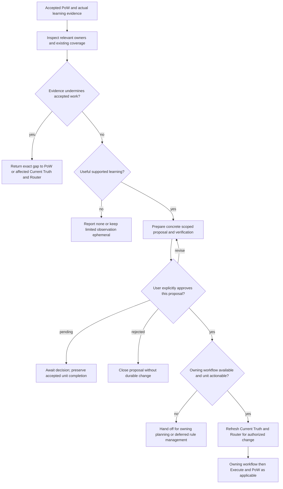

# H1-T22: Establish Learning Promotion

## Parent and outcome

[H1](../epics/H1-build-adaptive-repository-harness.md) requires runtime
discoveries to remain ephemeral or become useful durable guidance through a
controlled learning process. This node evaluates learning supported by
accepted Proof of Work and proposes the smallest useful promotion. Every
durable change waits for explicit user approval of the concrete proposal.

This is one technical unit under approved H1, not a new product story.
The product PRD supplies no H1 behavior and requires no change. H1-T21 is
implemented, so this task is ready for implementation. Planning approval does
not authorize implementation.

## Inputs and evaluation basis

- Consume the accepted PoW unit, governing work basis, final evidence,
  limitations and any actual learning candidate. Inspect only relevant
  canonical sources and existing enforcement before proposing a destination.
- Distinguish an observed fact, an existing approved decision and a proposed
  new policy. Accepted task proof does not establish that a lesson generalizes
  beyond its demonstrated scope. A single strong example may support a narrow
  correction; recurrence is evidence of reuse, not a mandatory numeric quota.
- Evaluate whether the lesson has a credible future use, whether existing
  guidance or checks already cover it, and whether its cost and scope are
  proportional. Prefer amending the owning source over creating a duplicate.
  Uncertain generalization stays ephemeral with its limits disclosed.
- Use Current Truth for a sourced ephemeral view, not as a new durable store.
  Durable facts or decisions belong to their existing canonical owners.
  A test, lint, script, hook or skill may enforce an approved semantic rule;
  it must not silently invent a new product or governance requirement.
- No useful supported candidate is a successful `none` outcome. No mandatory
  lesson, ledger, saved capsule, learning directory or artifact accompanies
  every completed task.

## Workflow and authority



1. **Reconcile.** Confirm that the inputs concern accepted proof for the
   current unit. Unaccepted or stale proof returns to PoW rather than being
   repaired inside Learning Promotion. Reinspect rules when scope or rules
   change; stop on invalid Constitution or a cited rule conflict. New evidence
   undermining an accepted claim must remain visible and return to PoW for
   proof assessment, or through affected Current Truth to Router for a
   materially changed basis. Goal/scope drift returns to Intent.
2. **Select.** Explain the evidenced lesson, supported scope and reuse need.
   Inspect existing ownership and coverage. Return `none` when there is no
   useful candidate or existing coverage already suffices; keep inconclusive
   observations ephemeral instead of presenting them as settled requirements.
3. **Propose.** Present a concrete change or reviewable draft in conversation:
   evidence and source references, exact destination and intended change,
   semantic basis, benefit, limitations, proportional verification, canonical
   owner and conditions that require revalidation or retirement. Creating a
   saved proposal or persistent memory is itself a durable write and also
   requires approval. Do not write a draft merely to request that approval.
4. **Await authority.** Ask for explicit approval of that proposal before any
   durable write, including small documentation corrections, tests and memory.
   Prior authority for the completed task, PoW acceptance, silence or structural
   validation does not approve promotion. A materially revised proposal needs
   renewed approval. Rejection closes the proposal; pending approval leaves it
   conversational. Neither blocks or reverses the accepted unit's completion
   unless new evidence actually undermines that proof.
5. **Hand off.** Approval authorizes only the specified promotion, not arbitrary
   changes or waived verification. Refresh affected Current Truth and let
   Router select the owning route for actionable work. Product behavior changes
   need their own approved contract; acceptance-scenario ownership remains
   separate. Constitution candidates go to H1-T24's rule-management boundary;
   this node does not implement proposal review, activation, revision,
   supersession or retirement procedures. If the required workflow is not
   installed or the change needs planning, report that exact handoff without
   looking up an absent rule or mutating directly. Never label a proposal
   `promoted` until its owning workflow has completed and verified the change.

The conversational meanings are `none`, `proposed`, `awaiting_approval`,
`declined`, and `handed_off`; they are not a shared schema or persisted state
machine. A later approved promotion is another bounded unit with its own
evidence. Do not regenerate the same proposal on its learning handoff unless
new evidence warrants another change.

```text
Learning: <unit> — <outcome>.
Evidence and scope: <sources, demonstrated lesson and limits; none>.
Proposal: <exact owning target and change, semantic basis, benefit and verification; none>.
Maintenance: <owner and revalidation/retirement condition; if proposing>.
Next: <approval decision or exact owning handoff; completed unit remains accepted>.
```

## Implementation guidance and deliverables

1. Add generic framework-origin `rule-learning-promotion-r1.md` under
   `.harness/workflow/`, stable ID `rule-learning-promotion`, with
   `contextLoading: on_demand`. Use the flowchart, short procedure and paired
   bad/good examples for unsupported generalization, duplicate coverage,
   ephemeral versus saved proposals, approval boundaries, owner selection and
   pending learning versus completion.
2. Publish a superseding PoW revision that, only after accepted assessment,
   runs `inspect-workflow rule-learning-promotion` with current relevant paths
   and reads its returned family. Preserve PoW's evidence, verification,
   repair and return ownership. Learning Promotion returning to PoW explicitly
   looks up `rule-proof-of-work` if its current effective family is not loaded
   or scope/rules changed. No eager `extends` relationship couples the nodes.
3. Preserve bootstrap, route and planning-only isolation. Execute still reaches
   PoW through its own selective handoff; pending promotion is no new gate on
   task completion. Do not add mandatory reviewers, automatic enforcement,
   evidence thresholds or durable learning storage.
4. Install this approved H1 node as a new pinned snapshot under H1-T1's bounded
   construction authorization. Preserve published revisions and update version,
   installation provenance, framework digest and derived index consistently;
   rebuild and validate. That construction authority installs the approved
   generic node; it does not authorize runtime learning writes or project-rule
   activation. Deterministic scripts enforce structure and selective lookup,
   not semantic learning quality or proof of human approval.

No learned project rule, product test, skill, script or saved memory is created
as a sample promotion in this implementation. H1-T24 and general framework
upgrade/reinstall remain deferred; this task installs no placeholder workflow.

## Functional and non-functional acceptance criteria

- Accepted Direct and planned execution can reach the same selectively loaded
  learning assessment. Unaccepted proof cannot be treated as completed input.
- Every proposal links actual evidence to a bounded reusable lesson, checks
  existing coverage and identifies one canonical owner and concrete change.
- Unsupported or unnecessary learning remains ephemeral or ends as `none`;
  ordinary completion requires no durable learning artifact.
- Every durable promotion write waits for explicit approval of its concrete
  proposal, including saving the proposal itself. Material revisions require
  renewed approval and no approved proposal bypasses its owning workflow.
- Pending or rejected learning preserves accepted unit completion. New evidence
  that undermines proof is disclosed and returned to the correct owner.
- Constitution lifecycle, product-contract and acceptance-scenario boundaries
  remain intact; an unavailable target workflow produces a precise handoff.
- Guidance stays concise and proportional, preserves shared-worktree changes,
  separates facts from policy, and specifies freshness and retirement ownership
  without introducing a second source of truth.
- Snapshot integrity and selective workflow isolation remain valid.

## Test and verification plan

- Walk through accepted Direct and planned units with no lesson, existing
  coverage, narrowly supported evidence and uncertain generalization. Confirm
  no invented rule, forced artifact or fixed recurrence threshold.
- Propose a canonical documentation correction and enforcement of an existing
  approved rule. Verify concrete targets, evidence, verification and maintenance
  conditions; saving even the proposal awaits explicit approval.
- Exercise pending, rejected, approved and materially revised proposals.
  Confirm no durable write precedes specific approval, completion stays bounded,
  and approved work returns to its applicable workflow and proof assessment.
- Exercise an unsupported product requirement, a Constitution candidate with
  H1-T24 absent, and a change needing planning. Confirm no direct mutation,
  absent lookup or inferred rule activation, and precise owning handoffs.
- Exercise stale/unaccepted PoW inputs, new evidence undermining proof,
  material basis changes, scope drift, invalid Constitution and rule conflict.
  Confirm exact returns or stops and preservation of partial effects.
- Verify bootstrap, Router, Direct, Plan and Execute lookups exclude Learning
  Promotion. PoW lookup must not eagerly load it; explicit learning lookup
  returns only its effective family. Verify the superseding accepted-PoW
  handoff names the real installed workflow and planning-only requests end at
  package delivery. A later promoted unit must not repeat unchanged learning.
- Use isolated Constitution tests for snapshot/index/lookup behavior and
  recorded workflow walkthroughs for semantic decisions. At implementation
  handoff run:

```bash
rtk proxy .harness/scripts/validate-constitution validate
rtk mise run format
rtk mise run lint
rtk mise run test
rtk git diff --check
```

## Definition of done

The installed generic node assesses actual learning from accepted proof,
offers concrete evidence-backed proposals or none, awaits approval before
every durable write, and hands approved work to its owning boundary. PoW loads
it selectively without making promotion a completion gate. Required checks
pass. At implementation completion classify actual acceptance impact and
update task/epic/dashboard; do not change `docs/testing/`.

## References and planning review

- [Parent H1](../epics/H1-build-adaptive-repository-harness.md)
- [H1-T1 Constitution](H1-T1-implement-constitution.md)
- [H1-T18A lazy loading](H1-T18A-lazy-workflow-loading.md)
- [H1-T21 Proof of Work](H1-T21-proof-of-work.md)
- [Deferred work and H1-T24](../handoff/H1-deferred-work.md)
- [Constitution lookup](../../.harness/README.md)
- Current rules: `rule-authority-r1`, `rule-governance-r1`,
  `rule-current-truth-r1`, `rule-risk-router-r2`, `rule-plan-r2`.

The user confirmed Intent, proposal-only learning with approval before durable
changes, and the exact repository artifact set. Independent decision review:
`READY`. After drafting, H1-T1, H1-T18A and H1-T21 were re-read against
the parent H1 contract. Versioning and bounded construction authority, selective
lookup, accepted-proof input, approval ownership, canonicality and return
boundaries: `NO CONFLICT`. Fresh independent direct-document review: `READY`,
with no material blocker. Implementation remains `blocked` by H1-T21; no
product source or acceptance-scenario files were changed.

## Implementation result

Implemented the generic on-demand Learning Promotion workflow and a superseding
Proof of Work handoff in the pinned 1.13.0 Constitution snapshot. Learning
Promotion evaluates only accepted proof, keeps unsupported or already-covered
observations ephemeral, presents a concrete proposal before durable changes,
and preserves accepted unit completion while approval is pending or declined.
PoW now selectively loads the installed learning workflow after accepted proof.

The derived index and isolated Constitution tests verify the independent
Learning Promotion lookup, bootstrap exclusion, retained PoW revision history,
and selective PoW handoff. Acceptance impact: `none`, because this changes
repository-harness behavior only.
